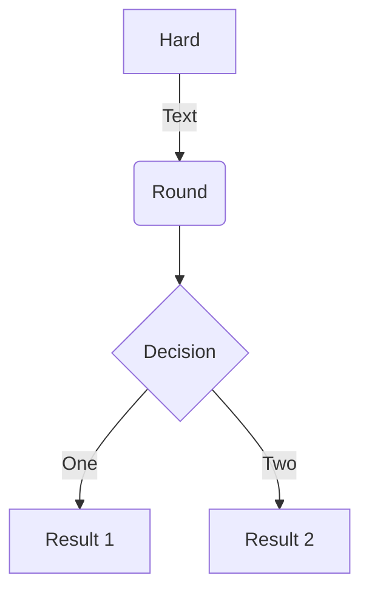
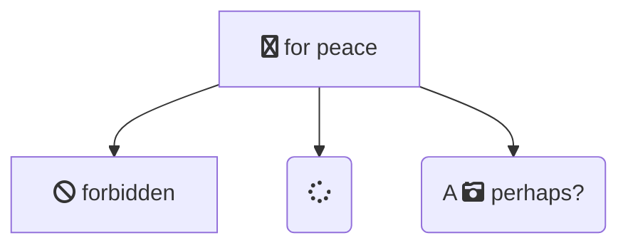

---
title: All Utilities
weight: 70
draft: true
----

<section class="max-w-5xl">
  <div class="mb-12 sm:mb-4 text-covalent-pink ct-lg uppercase font-sans md:text-sm md:mb-4 md:mt-4 sm:mt-4">
    Header 
  </div>

  <!-- Text can be **bold**, _italic_, or ~~strikethrough~~. [Links](https://gohugo.io) should be blue with no underlines (unless hovered over). -->

  <p class="text-xl text-gray-800 mb-6">
    There should be whitespace between paragraphs. Vape migas chillwave sriracha poutine try-hard distillery. Tattooed shabby chic small batch, pabst art party heirloom letterpress air plant pop-up. Sustainable chia skateboard art party banjo cardigan normcore affogato vexillologist quinoa meggings man bun master cleanse shoreditch readymade. Yuccie prism four dollar toast tbh cardigan iPhone, tumblr listicle live-edge VHS. Pug lyft normcore hot chicken biodiesel, actually keffiyeh thundercats photo booth pour-over twee fam food truck microdosing banh mi. Vice activated charcoal raclette unicorn live-edge post-ironic. Heirloom vexillologist coloring book, beard deep v letterpress echo park humblebrag tilde.
  </p>
  <p class="text-xl text-gray-800 mb-6">
    90's four loko seitan photo booth gochujang freegan tumeric listicle fam ugh humblebrag. Bespoke leggings gastropub, biodiesel brunch pug fashion axe meh swag art party neutra deep v chia. Enamel pin fanny pack knausgaard tofu, artisan cronut hammock meditation occupy master cleanse chartreuse lumbersexual. Kombucha kogi viral truffaut synth distillery single-origin coffee ugh slow-carb marfa selfies. Pitchfork schlitz semiotics fanny pack, ugh artisan vegan vaporware hexagon. Polaroid fixie post-ironic venmo wolf ramps **kale chips**.
  </p>
</section>
<!-- > There should be no margin above this first sentence.
>
> Blockquotes should be a lighter gray with a border along the left side in the secondary color.
>
> There should be no margin below this final sentence. -->

<section class="max-w-5xl">
  <div class="text-2xl text-gray-800 mt-12 mb-6 pb-3 border-b">
    First Header 2
  </div>
  <p class="text-xl text-gray-800 mb-6">
    Example Highlight text
  </p>
  <p class="text-xl text-gray-800 mb-6">
  This is a normal paragraph following a header. Knausgaard kale chips snackwave microdosing cronut copper mug swag synth bitters letterpress glossier **craft beer**. 
  <span class="bg-gray-500 text-white py-1 px-2 rounded-md">
      Highlight
  </span>
  bushwick authentic gochujang vegan chambray meditation jean shorts irony. Viral farm-to-table kale chips, pork belly palo santo distillery activated charcoal aesthetic jianbing air plant woke lomo VHS organic. Tattooed locavore succulents heirloom, small batch sriracha echo park DIY af. Shaman you probably haven't heard of them 
  <span class="bg-gray-500 text-white py-1 px-2 rounded-md">
      Highlight
  </span>
  copper mug, crucifix green juice vape *single-origin coffee* brunch actually. Mustache etsy vexillologist raclette authentic fam. Tousled beard humblebrag asymmetrical. I love turkey, I love my job, I love my friends, I love Chardonnay!
  </p>
  <p class="text-xl text-gray-800 mb-6">
  Deae legum paulatimque terra, non vos mutata tacet: dic. Vocant docuique me plumas fila quin afuerunt copia haec o neque.

  On big screens, paragraphs and headings should not take up the full container width, but we want tables, code blocks and similar to take the full width.
  </p>
  Scenester tumeric pickled, authentic crucifix post-ironic fam freegan VHS pork belly 8-bit yuccie PBR&B. **I love this life we live in**.

</section>


<section class="max-w-5xl">
  <div class="text-2xl text-gray-800 mt-12 mb-6 pb-3 border-b">
    First Header 3
  </div>
  <p class="text-xl text-gray-800 mb-6">
  Example for code blocks
  </p>
  <p class="text-xl font-bold mb-6">
    Code block
  </p>
  <pre class="whitespace-pre mb-6 sm:whitespace-normal w-full sm:overflow-scroll code md:overflow-scroll">
    curl -X GET https://api.covalenthq.com/v1/ENDPOINT/?key=API_KEY
  </pre>
</section>
<!-- ### Header 3
This s a code block following a header.
Next level leggings before they sold out, PBR&B church-key shaman echo park. Kale chips occupy godard whatever pop-up freegan pork belly selfies. Gastropub Belinda subway tile woke post-ironic seitan. Shabby chic man bun semiotics vape, chia messenger bag plaid cardigan. -->

<section class="max-w-5xl">
  <div class="text-2xl text-gray-800 mt-12 mb-6 pb-3 border-b">
      First Header 4
  </div>
  <p class="text-xl text-gray-800 mb-6">
    Example for unordered lists
  </p>
  <ul class="list-disc my-6 text-xl text-gray-800">
    <li class="ml-8">
      unordered list
    </li>
    <li class="ml-8">
      unordered list
    </li>
    <li class="ml-8">
    unordered list 
  </li>
  </ul>
</section>

<section class="max-w-5xl">
  <div class="text-2xl text-gray-800 mt-12 mb-6 pb-3 border-b">
      First Header 5
  </div>
  <p class="text-xl text-gray-800 mb-6">
    Example for links
  </p>
  <ul class="list-disc my-6 text-xl text-gray-800">
    <li class="ml-8">
     <a class="text-covalent-pink" href="">
        Link
     </a>
    </li>
    <li class="ml-8">
      <a class="text-covalent-pink" href="">
        Link
     </a>
    </li>
    <li class="ml-8">
      <a class="text-covalent-pink" href="">
        Link
     </a>
  </li>
  </ul>
</section>

<!-- ##### Header 5

1. This is an ordered list following a header.
2. This is an ordered list following a header.
3. This is an ordered list following a header. -->


<section class="max-w-5xl">
  <div class="text-2xl text-gray-800 mt-12 mb-6 pb-3 border-b">
      First Header 6
  </div>
  <p class="text-xl text-gray-800 mb-6">
    Example for tables
  </p>

<div class="w-full sm:overflow-scroll code">
  <table class="table-auto mb-12 sm:w-full sm:sm:overflow-scroll code">
  <thead>
      <tr>
        <th class="border px-4 font-bold py-2">
              <div class="font-bold text-xl text-gray-800">Title1</div>
        </th>
        <th class="border px-4 font-bold py-2">
              <div class="font-bold text-xl text-gray-800">Title2</div>
          </th>
        <th class="border px-4 font-bold py-2">
              <div class="font-bold text-xl text-gray-800">Title3</div>
          </th>
        </tr>
    </thead>
    <tbody>
      <tr>
        <td class="border px-4 py-2 text-xl text-gray-800">
          <span class="bg-gray-500 text-white py-1 px-2 rounded-md">
            data
          </span>
        </td>
        <td class="border px-4 py-2 text-xl text-gray-800">
          100
        </td>
        <td class="border px-4 py-2 text-xl text-gray-800">
          test
        </td>
      </tr>
      <tr>
        <td class="border px-4 py-2 text-xl text-gray-800">
          <span class="bg-gray-500 text-white py-1 px-2 rounded-md">
              data
          </span>
        </td>
        <td class="border px-4 py-2 text-xl text-gray-800">
            0
        </td>
        <td class="border px-4 py-2 text-xl text-gray-800">
          test
        </td>
      </tr>
    </tbody>
  </table>
</div>

</section>
----------------
<!-- 
There's a horizontal rule above and below this.

----------------

Here is an unordered list:

* Liverpool F.C.
* Chelsea F.C.
* Manchester United F.C.

And an ordered list:

1. Michael Brecker
2. Seamus Blake
3. Branford Marsalis

And an unordered task list:

- [x] Create a Hugo theme
- [x] Add task lists to it
- [ ] Take a vacation

And a "mixed" task list:

- [ ] Pack bags
- ?
- [ ] Travel!

And a nested list:
And a nested list:

* Jackson 5
  * Michael
  * Tito
  * Jackie
  * Marlon
  * Jermaine
* TMNT
  * Leonardo
  * Michelangelo
  * Donatello
  * Raphael

Definition lists can be used with Markdown syntax. Definition headers are bold.

Name
: Godzilla

Born
: 1952

Birthplace
: Japan

Color
: Green
----------------

Tables should have bold headings and alternating shaded rows.

| Artist            | Album           | Year |
|-------------------|-----------------|------|
| Michael Jackson   | Thriller        | 1982 |
| Prince            | Purple Rain     | 1984 |
| Beastie Boys      | License to Ill  | 1986 |

If a table is too wide, it should scroll horizontally.

| Artist            | Album           | Year | Label       | Awards   | Songs     |
|-------------------|-----------------|------|-------------|----------|-----------|
| Michael Jackson   | Thriller        | 1982 | Epic Records | Grammy Award for Album of the Year, American Music Award for Favorite Pop/Rock Album, American M
usic Award for Favorite Soul/R&B Album, Brit Award for Best Selling Album, Grammy Award for Best Engineered Album, Non-Classical | Wanna Be Startin' Somethin'
, Baby Be Mine, The Girl Is Mine, Thriller, Beat It, Billie Jean, Human Nature, P.Y.T. (Pretty Young Thing), The Lady in My Life |
| Prince            | Purple Rain     | 1984 | Warner Brothers Records | Grammy Award for Best Score Soundtrack for Visual Media, American Music Award for Fav
orite Pop/Rock Album, American Music Award for Favorite Soul/R&B Album, Brit Award for Best Soundtrack/Cast Recording, Grammy Award for Best Rock Performance
by a Duo or Group with Vocal | Let's Go Crazy, Take Me With U, The Beautiful Ones, Computer Blue, Darling Nikki, When Doves Cry, I Would Die 4 U, Baby I'm a S
tar, Purple Rain |
| Beastie Boys      | License to Ill  | 1986 | Mercury Records | noawardsbutthistablecelliswide | Rhymin & Stealin, The New Style, She's Crafty, Posse in Effe
ct, Slow Ride, Girls, (You Gotta) Fight for Your Right, No Sleep Till Brooklyn, Paul Revere, Hold It Now, Hit It, Brass Monkey, Slow and Low, Time to Get Ill
|

----------------

Code snippets like `var foo = "bar";` can be shown inline.

Also, `this should vertically align` ~~`with this`~~ ~~and this~~.

Code can also be shown in a block element.

```
foo := "bar";
bar := "foo";
```

Code can also use syntax highlighting.

```go
func main() {
  input := `var foo = "bar";`

  lexer := lexers.Get("javascript")
  iterator, _ := lexer.Tokenise(nil, input)
  style := styles.Get("github")
  formatter := html.New(html.WithLineNumbers())

  var buff bytes.Buffer
  formatter.Format(&buff, style, iterator)

  fmt.Println(buff.String())
}
```

```
Long, single-line code blocks should not wrap. They should horizontally scroll if they are too long. This line should be long enough to demonstrate this.
```

Inline code inside table cells should still be distinguishable.

| Language    | Code               |
|-------------|--------------------|
| Javascript  | `var foo = "bar";` |
| Ruby        | `foo = "bar"{`      |

----------------

Small images should be shown at their actual size.


Large images should always scale down and fit in the content container.


_The photo above of the Spruce Picea abies shoot with foliage buds: Bjørn Erik Pedersen, CC-BY-SA._


## Components

## Mermaid






### Alerts

This is an alert.
This is an alert with a title.
{}This is an alert with a title and **Markdown**.{}
This is a successful alert.
This is a warning.
This is a warning with a title.


## Another Heading

Add some sections here to see how the ToC looks like. Bacon ipsum dolor sit amet t-bone doner shank drumstick, pork belly porchetta chuck sausage brisket ham
hock rump pig. Chuck kielbasa leberkas, pork bresaola ham hock filet mignon cow shoulder short ribs biltong.

### This Document

Inguina genus: Anaphen post: lingua violente voce suae meus aetate diversi. Orbis unam nec flammaeque status deam Silenum erat et a ferrea. Excitus rigidum ai
t: vestro et Herculis convicia: nitidae deseruit coniuge Proteaque adiciam *eripitur*? Sitim noceat signa *probat quidem*. Sua longis *fugatis* quidem genae.


### Pixel Count

Tilde photo booth wayfarers cliche lomo intelligentsia man braid kombucha vaporware farm-to-table mixtape portland. PBR&B pickled cornhole ugh try-hard ethica
l subway tile. Fixie paleo intelligentsia pabst. Ennui waistcoat vinyl gochujang. Poutine salvia authentic affogato, chambray lumbersexual shabby chic.

### Contact Info

Plaid hell of cred microdosing, succulents tilde pour-over. Offal shabby chic 3 wolf moon blue bottle raw denim normcore poutine pork belly.

### External Links

Stumptown PBR&B keytar plaid street art, forage XOXO pitchfork selvage affogato green juice listicle pickled everyday carry hashtag. Organic sustainable lette
rpress sartorial scenester intelligentsia swag bushwick. Put a bird on it stumptown neutra locavore. IPhone typewriter messenger bag narwhal. Ennui cold-press
ed seitan flannel keytar, single-origin coffee adaptogen occupy yuccie williamsburg chillwave shoreditch forage waistcoat.


```
This is the final element on the page and there should be no margin below this.
``` -->