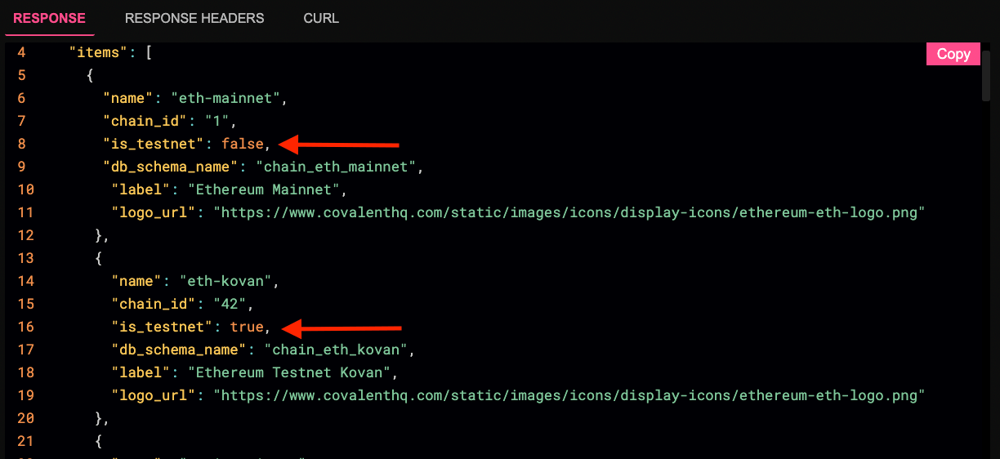
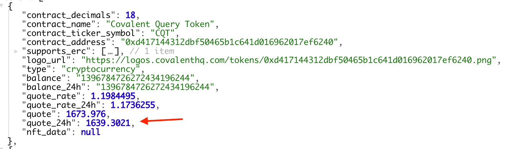

# August 2021


## 2021-08-31

### ADDED
- The API now supports image resizing for NFTs for the following resolutions: `256`, `512`, `1024`. 

- Developers can check if a network is a Testnet or Mainnet using `is_testnet` on the `Get all chains`and `Get all chain statuses`. The `"is_testnet"` is a boolean response returning `false` when a network is not a testnet and `true` for when a network is a testnet. 



- We have added a new field to the returned data on the [`Balance_V2`](https://www.covalenthq.com/docs/api/#get-/v1/{chain_id}/address/{address}/balances_v2/) endpoint `quote_rate_24`. The `quote_rate_24` is the price of the token as of 24 hours ago. An example query on the Covalent Token CQT is: 
https://api.covalenthq.com/v1/1/address/0x4754B849DC5164C4e09f5dE6639077438A94d205/balances_v2/?key=’your_api_key’



The percent change is calculated thus:
```javascript
Quote - Quote24h = X
X / Quote24h * 100% = % change in a 24h period
```
- We added LP Token Prices to the AMMs available via the `XY=K` endpoints. Developers can query the data via the `Pricing_v2` endpoints. 

- New Primer Features:  `$concat` , `$multiply` , `$subtract`. Example query -
[`https://api.covalenthq.com/v1/1/events/address/0xcd4EC7b66fbc029C116BA9Ffb3e59351c20B5B06/?ending-block=latest&key='your_api_key'&group={"_id":"block_signed_at","product":{"$multiply":[10,100,15]},"productWithFields":{"$multiply":["block_height","log_offset","tx_offset"]},"quotient":{"$divide":["tx_offset",2]},"differenceBetweenDates":{"$subtract":["2021-08-03T21:51:36Z","2021-07-03T06:23:43Z"]},"differenceBetweenNumbers":{"$subtract":[10,2]}}`](https://api.covalenthq.com/v1/1/events/address/0xcd4EC7b66fbc029C116BA9Ffb3e59351c20B5B06/?ending-block=latest&key=ckey_66c94c405aae4cb38d94092f634&group={"_id":"block_signed_at","product":{"$multiply":[10,100,15]},"productWithFields":{"$multiply":["block_height","log_offset","tx_offset"]},"quotient":{"$divide":["tx_offset",2]},"differenceBetweenDates":{"$subtract":["2021-08-03T21:51:36Z","2021-07-03T06:23:43Z"]},"differenceBetweenNumbers":{"$subtract":[10,2]}})

`$pow` Example query - [`https://api.covalenthq.com/v1/1/events/address/0xcd4EC7b66fbc029C116BA9Ffb3e59351c20B5B06/?ending-block=12894073&key='your_api_key'&primer=[{"$match":{"decoded.name":"Buy"}},{"$group":{"_id":{"buyer":"decoded.params.7.value"},"ethPrice":{"$divide":[89000000000000000,{"$pow": [10,18]}]}}}]`](https://api.covalenthq.com/v1/1/events/address/0xcd4EC7b66fbc029C116BA9Ffb3e59351c20B5B06/?ending-block=12894073&key=ckey_66c94c405aae4cb38d94092f634&primer=[{"$match":{"decoded.name":"Buy"}},{"$group":{"_id":{"buyer":"decoded.params.7.value"},"ethPrice":{"$divide":[89000000000000000,{"$pow": [10,18]}]}}}])


- The Covalent `XY=K` endpoint provides data for large DEXs which are clones of the core Uniswap code base, such as QuickSwap and SushiSwap. Read more about the first release in the [June](../june) Changelog. We have updated the endpoint to include 2 new DEXs:
[Moonlift](https://dex.moonlift.io/#/swap) and [Empire DEX](https://bsc.empiredex.org/#/swap)


### UPDATE
- The `Historical Portfolio` is running faster, this is a result of a Caffeine caching object which we implemented that ensures data is stored in memory rather than having to query the entire database. This results in much faster response times for parts of the API layer. Making the internal fetch of pricing data many times faster. This we have applied across the many of our endpoints that use our pricing services.

### BUG FIXES 

- Fixed calculation bug in CompoundService - [Issue-564]((https://github.com/covalenthq/scout/issues/564))

- Fixed Http response 500 error in Primer Query: `$group` - [Issue-894](https://github.com/covalenthq/scout/issues/894)

- Fixed missing events in `TopicHashCalculator` - [Issue-559](https://github.com/covalenthq/scout/issues/559) 
