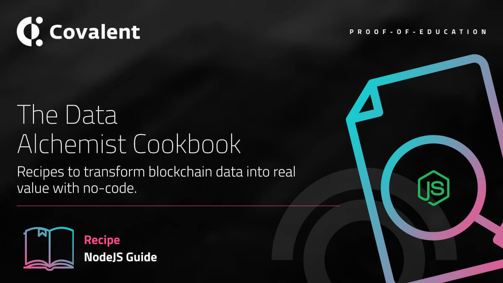

# NodeJS Guide

<Aside>

**Outcome:** Learn how to integrate the Covalent API into a NodeJS project. Useful for Backend developers who want to start interacting with Blockchain data.

</Aside>

&nbsp;

## Introduction

Node.js is an open-source, cross-platform, back-end JavaScript runtime environment that runs on the V8 engine and executes JavaScript code outside a web browser. Node.js lets developers use JavaScript to write command line tools and for server-side scripting — running scripts server-side to produce dynamic web page content before the page is sent to the user's web browser. 

Most developers refer to Node.js as a framework. But, actually it is a run-time environment for building world-class web applications. It allows you to run the JavaScript applications outside of the browser.

Express is a minimal and flexible Node.js web application framework that provides a robust set of features for web and mobile applications.

In this article will use an npm package [`node-fetch`](https://www.npmjs.com/package/node-fetch) which is a light-weight module that brings `window.fetch` to Node.js to build a NodeJS app using the Express framework.

&nbsp;

## Endpoints Summary:

All Covalent Endpoints.


&nbsp;

## Prerequisites:

First, initialize a project using npm and the install the required dependencies.

- Create a dir where you want to build the app and move into the dir.
    - `$ mkdir nodeguide && cd nodeguide`
- Initialize the project using npm
    - `$ npm init -y` 
    
    #The -y flag will trigger automatically populated initialization. 
- Install expressjs, body-parser and node-fetch packages
    - `$ npm install express body-parser node-fetch`
- Install nodemon as a dev dependency so you do not have to often restart the server
    - `$ npm install nodemon -save-dev`

&nbsp;
## Code:

Create an `index.js` and place the following code:

```code
//required dependencies
const express = require('express');
const bodyParser = require('body-parser');
const fetch = require('node-fetch');
const app = express();

//body parser is used to render JSON formatted responses
app.use(bodyParser.json());
app.use(bodyParser.urlencoded({ extended: false }));

//index path where we can view the response in a browser or postman
app.get('/index', (req, res) => {
    res.status(200).json({ msg: "Welcome" })
})

//error Handling set up
app.use((req, res, next) => {
  const error = new Error('404 Page Not found');
  error.status = 404;
  next(error);
});

app.use((error, req, res, next) => {
  res.status(error.status || 500);
  res.json({
    error: {
      message: error.message
    }
  });
});

//server configuration to run the app
const port = 8000;  
app.listen(port, () => console.log(`App running on port ${port}!`))

module.exports = app;

```

To run the app, Open `package.json` file add the following line under `scripts`:
- `"start" : "nodemon index"`

In the terminal, run the command: `$ nodemon index` you should see the following message: `App running on port 8000!` 

Open your browser or postman and go to `http://localhost:8000/index` You will see the following json response: 

```json
{
"msg": "Welcome"
}
```

Now that our App is up and running, the next step will be to add the Covalent API url path and that will give the app the capability to interact with all Covalent endpoints.

We will update the `index.js` file as shown below

```code

//add the code below before app.get()
const url = 'https://api.covalenthq.com/v1'
const key = 'ckey_onemillionwallets' //example key
const chain_id = '1' //ethereum network chainID on Covalent
const address = '0x8076c74c5e3f5852037f31ff0093eeb8c8add8d3' //example address


//add the code below after app.get()
app.get('/token-balance', async(req, res) =>{
  try {
      const data = await fetch(`${url}/${chain_id}/address/${address}/balances_v2`, 
                                { 
                                    headers: { 'content-type': 'application/json' }
                                }
                              )
      const response = await data.json()
      console.log(response.data)
      res.status(200).json(response.data)
  } catch (error) {
      res.status(500).json(error)
  }
})
```
Code explanation: This is a promise based async request which uses node-fetch to make request to the API and return a json based response format in the Browser. The console log statements are there to also affirm the response object in the console. The response is below


```json
{
  "data": {
            "address": "0x8076c74c5e3f5852037f31ff0093eeb8c8add8d3",
            "updated_at": "2021-05-06T12:17:29.588048157Z",
            "next_update_at": "2021-05-06T12:22:29.588048677Z",
            "quote_currency": "USD",
            "chain_id": 1,
            "items": [
                        {
                            "contract_decimals": 18,
                            "contract_name": "Ether",
                            "contract_ticker_symbol": "ETH",
                            "contract_address": "0xeeeeeeeeeeeeeeeeeeeeeeeeeeeeeeeeeeeeeeee",
                            "supports_erc": null,
                            "logo_url": "https://logos.covalenthq.com/tokens/0xeeeeeeeeeeeeeeeeeeeeeeeeeeeeeeeeeeeeeeee.png",
                            "type": "cryptocurrency",
                            "balance": "39702890587172583609",
                            "quote_rate": 3513.734,
                            "quote": 139505.39,
                            "nft_data": null
                        },
                        {
                            "contract_decimals": 6,
                            "contract_name": "Tether USD",
                            "contract_ticker_symbol": "USDT",
                            "contract_address": "0xdac17f958d2ee523a2206206994597c13d831ec7",
                            "supports_erc": [
                                                "erc20"
                                            ],
                            "logo_url": "https://logos.covalenthq.com/tokens/0xdac17f958d2ee523a2206206994597c13d831ec7.png",
                            "type": "stablecoin",
                            "balance": "8541835994",
                            "quote_rate": 0.9994003,
                            "quote": 8536.714,
                            "nft_data": null
                        },
                        {
                            "contract_decimals": 18,
                            "contract_name": "Uniswap",
                            "contract_ticker_symbol": "UNI",
                            "contract_address": "0x1f9840a85d5af5bf1d1762f925bdaddc4201f984",
                            "supports_erc": [
                                                "erc20"
                                            ],
                            "logo_url": "https://logos.covalenthq.com/tokens/0x1f9840a85d5af5bf1d1762f925bdaddc4201f984.png",
                            "type": "cryptocurrency",
                            "balance": "90573100000000000000",
                            "quote_rate": 41.916298,
                            "quote": 3796.489,
                            "nft_data": null
                        },
    ],
    "pagination": null
  },
  "error": false,
  "error_message": null,
  "error_code": null
}
```

Using the code example above, you can thus write new endpoints and extend the arguements for all Covalent endpoints.

&nbsp;
# Extra Notes

You can use the [`dotenv`](https://www.npmjs.com/package/dotenv) package to hide your API keys.

&nbsp;
