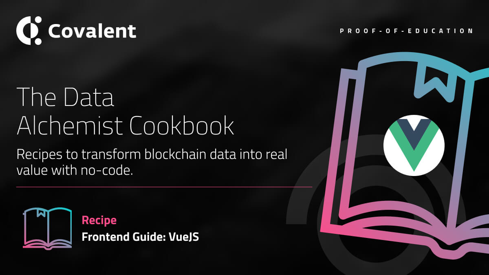
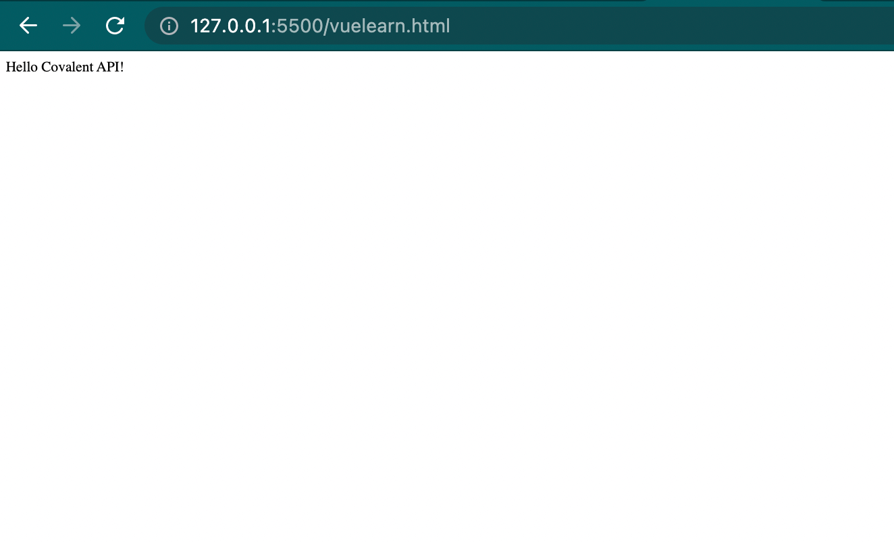

# Build a Simple VueJS APP using the Covalent API

<Aside>

**Outcome:** Learn how to consume the Covalent API using the VueJS front-end framework. We will builf a simple VueJS app consuming the `balances_v2` endpoint using `fetch` to return the Covalent API data.

</Aside>


# Introduction
The Covalent API is ideal for development teams building blockchain dApps and infrastructure requiring real time access to Blockchain data. This is because it is simply the fastest way for teams to access granular and historical on-chain data without code, unlocking 'One Billion possibilities'. Hence, this is why the Covalent API is described as the `no code` solution. 

The Covalent API is RESTful. The default return format for all endpoints is `JSON`. `CSV` format is supported for some endpoints. A Covalent API key must be passed as a query parameter with all requests using: `key=API_KEY`

The refresh rate is classified as: `real-time: 30s or 2 blocks`, `batch: 10m or 40 blocks`

The primary query parameter to switch between blockchain networks is the `chain_id`. So for example, to fetch all the token balances (including NFTs) of a wallet address on Ethereum and Binance Smart Chain, requests are made to the `balances_v2` endpoint:

`https://api.covalenthq.com/v1/{chain_id}/address/{address}/balances_v2/` 

where `chain_id` is `1` for Ethereum mainnet and `56` for BSC mainnet. 

For this example project we will be querying the `Get token balances for address` endpoint commonly called the `balances_v2` endpoint.

## Getting Covalent API KEY
Visit https://www.covalenthq.com/platform/#/auth/register/ and fill the form. Login to the Dashboard and copy the API KEY. You will need it for the project.


## VueJS 
[Vue](https://vuejs.org/v2/guide/) (pronounced /vjuː/, like view) is a progressive framework for building user interfaces. Unlike other monolithic frameworks, Vue is designed from the ground up to be incrementally adoptable. The core library is focused on the view layer only, and is easy to pick up and integrate with other libraries or existing projects. 

You can read more about Vue installation and starting a Vue project here: https://vuejs.org/v2/guide/#Getting-Started 


## Starting Template
Open any directory of your choice on your PC and create a folder vueCovalent, (deliberate play on words. Lol). Create an `index.html` and add the code below

```javascript
<!DOCTYPE html>
<html>
  <head>
    <title>Covalent API Vue app</title>
  </head>
  <body>
    <div id="app">
      {{ message }}
    </div>
    <script src="https://unpkg.com/vue"></script>
    <script>
      var app = new Vue({
      		el: '#app',
      		data: {
        				message: 'Hello Covalent API!'
      			}
    			})
    </script>
  </body>
</html>
```

Open the page on your browser and you will see the following page displayed: 



We are not going to focus on styling this page. We will write a simple VueJS `v-for` directive to query the Covalent API `balances_v2` endpoint and return the data using the Axios library.

Add Axios via the CDN 

```javascript
<script src="https://unpkg.com/axios/dist/axios.min.js"></script>
```

Update the JavaScript to call the `balances_v2` endpoint with a wallet address on Ethereum. We will be using the mounted lifecycle hook.

```javascript
<script src="https://unpkg.com/axios/dist/axios.min.js"></script>
  <script>
    var app = new Vue({
      el: '#app',
      data() {
        return {
          info: [],
          data: [],
        }
      },
      mounted () {      axios.get('https://api.covalenthq.com/v1/1/address/{address}/balances_v2/?key={API-KEY}')
        .then(response => {
           this.info = response.data;
           this.data = response.data.data.items
         })
      }
    })
  </script>
```

## Let’s break down the code:
The data method is refactored to return 2 arrays, `info` and `data`. The 2 arrays target the response of the API call. Breaking down the Axios call: When Axios makes a get request to the endpoint a promise is returned which is resolved in the then block where the response is parsed to info and data arrays using the `this.info` and `this.data` respectively.

You can see the complete JSON response here: `https://api.covalenthq.com/v1/1/address/{address}/balances_v2/?key={API-KEY}` and you can identify why the need to separate the `items` array into the `this.data` using `response.data.data.items`. This will allow us to loop through the array response using the `v-for` directive.

Update the HTML to view the response:

```javascript
<div id="app">
 Welcome, Covalent API!
    {{info.data.address}} 
    <ul>
      <li v-for="item in data">
        {{ item.contract_name }}  {{ item.contract_ticker_symbol }}
      </li>
    </ul>
</div>
```

Now the app should look like this:


## Conclusion
There you have it, how to consume the Covalent API using the VueJS front-end framework! You can begin with this as a starting point and style your app and also consume multiple endpoints. Beginning from here, you can thus build whatever you want!

If you have any further questions, you can reach the DevRel team on the [Covalent Discord](https://covalenthq.com/discord) server.
