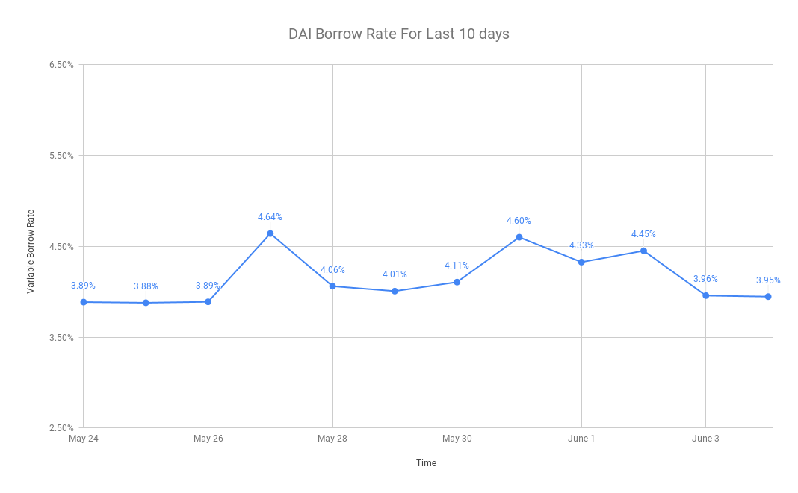

<!-- import Prerequisites from "../../../components/prerequisites.js"; -->

# Querying Historical Aave Borrow rate with Primer


## TLDR

<Aside>

In this guide, we want to get the historical borrow rates for `Aave v2 Markets` across 3 blockchains. We will use Primer's query parameters and also learn how to access array elements with Primer. 

</Aside>

<!--  -->

## Primer URL Syntax

For reference, we will use the following top-level query parameters as shown below. The rest of the top-level query parameters are available [here](https://www.covalenthq.com/docs/learn/tutorials/query-with-primer-beg)

<TableWrap>

|Name|Description|
|---|---|
|match|Filters the records to pass only the documents that match the specified condition(s).|
|group|Groups input elements by the specified _id expression and for each distinct grouping, outputs an element. Grouping by _date_ operators is also possible.|

</TableWrap>

## Getting Started

### Side note

<Aside>

We can also change the blockchain ID and the contract address and get the historical borrow rates for any market on any blockchain.

</Aside>

<TableWrap>

|Blockchain ID|Chain Name|LendingPool|Contract Address|
|---|---|---|---|
|1|`Ethereum Mainnet`|Aave V2|0x7d2768dE32b0b80b7a3454c06BdAc94A69DDc7A9|
|137|`Matic Mainnet`|Aave V2|0x8dff5e27ea6b7ac08ebfdf9eb090f32ee9a30fcf|

</TableWrap>

### Get borrow rates for Aave v2 Markets
 
 We now use the Covalent API [GET log events by topic hash](https://www.covalenthq.com/docs/api/#get-/v1/{chainId}/events/topics/{topic}/) endpoint with the following parameters. Note that the Covalent API currently limits the block range between the `starting-block` and the `ending-block` to 1 million blocks. Hence, this data will need to be fetched in batches of 1 million blocks.

<TableWrap>

|Parameter|Description|Value|
|---|---|---|
|`chainId`|`Ethereum Mainnet`|`1`|
|`topic`|`Reserve Data Updated`|`0x804c9b842b2748a22bb64b345453a3de7ca54a6ca45ce00d415894979e22897a`|
|`starting-block`|`current Ethereum mainnet block height, as of 2021-06-01T17:31:52Z `|`12500000`|
|`ending-block`|`latest block height value`|`latest`|
|`sender-address`|`Aave v2 Lending Pool`|`0x7d2768dE32b0b80b7a3454c06BdAc94A69DDc7A9`|

</TableWrap>

From Etherscan, the current Ethereum mainnet block height, as of "2021-06-01T17:31:52Z" is 12551266. For the ending-block field, we can use the value latest to ensure we get data up to the latest block height.


After feeding the parameters, this is what the endpoint looks like [https://api.covalenthq.com/v1/1/events/topics/0x804c9b842b2748a22bb64b345453a3de7ca54a6ca45ce00d415894979e22897a/?starting-block=12500000&ending-block=latest&sender-address=0x7d2768dE32b0b80b7a3454c06BdAc94A69DDc7A9&key=ckey_docs](https://api.covalenthq.com/v1/1/events/topics/0x804c9b842b2748a22bb64b345453a3de7ca54a6ca45ce00d415894979e22897a/?starting-block=12500000&ending-block=latest&sender-address=0x7d2768dE32b0b80b7a3454c06BdAc94A69DDc7A9&key=ckey_docs). 

Our response from the Covalent API looks something like this (only first couple records shown):

```json
{
  "data": {
    "updated_at": "2021-06-01T22:32:08.245291190Z",
    "items": [
      {
        "block_signed_at": "2021-05-24T23:17:48Z",
        "block_height": 12500001,
        "tx_offset": 55,
        "log_offset": 133,
        "tx_hash": "0xfcc8ac1834c9d4072769e3000cf0b31e717a63c669826af4135504c83f8b8277",
        "_raw_log_topics_bytes": null,
        "raw_log_topics": [
          "0x804c9b842b2748a22bb64b345453a3de7ca54a6ca45ce00d415894979e22897a",
          "0x000000000000000000000000514910771af9ca656af840dff83e8264ecf986ca"
        ],
        "sender_contract_decimals": null,
        "sender_name": null,
        "sender_contract_ticker_symbol": null,
        "sender_address": "0x7d2768de32b0b80b7a3454c06bdac94a69ddc7a9",
        "sender_address_label": null,
        "sender_logo_url": null,
        "raw_log_data": "0x00000000000000000000000000000000000000000000013844fd4b40c1a8d37b00000000000000000000000000000000000000000019de33cc7328f9059c58f500000000000000000000000000000000000000000000bc9e60c033968220a4ab0000000000000000000000000000000000000000033b51940b994f792ebbc8f20000000000000000000000000000000000000000033c50a65d561d37d0015b59",
        "decoded": {
          "name": "ReserveDataUpdated",
          "signature": "ReserveDataUpdated(indexed address reserve, uint256 liquidityRate, uint256 stableBorrowRate, uint256 variableBorrowRate, uint256 liquidityIndex, uint256 variableBorrowIndex)",
          "params": [
            {
              "name": "reserve",
              "type": "address",
              "indexed": true,
              "decoded": true,
              "value": "0x514910771af9ca656af840dff83e8264ecf986ca"
            },
            {
              "name": "liquidityRate",
              "type": "uint256",
              "indexed": false,
              "decoded": true,
              "value": "5760355363302566056827"
            },
            {
              "name": "stableBorrowRate",
              "type": "uint256",
              "indexed": false,
              "decoded": true,
              "value": "31272466365674405857351925"
            },
            {
              "name": "variableBorrowRate",
              "type": "uint256",
              "indexed": false,
              "decoded": true,
              "value": "890726455972084100146347"
            },
            {
              "name": "liquidityIndex",
              "type": "uint256",
              "indexed": false,
              "decoded": true,
              "value": "1000166895460320265505589490"
            },
            {
              "name": "variableBorrowIndex",
              "type": "uint256",
              "indexed": false,
              "decoded": true,
              "value": "1001371436844653983133948761"
            }
          ]
        }
      },
      {
        "block_signed_at": "2021-05-24T23:17:48Z",
        "block_height": 12500001,
        "tx_offset": 64,
        "log_offset": 165,
        "tx_hash": "0x2fc4a7f8dbe03cfb961af4620739f041378d6fcf11c398f175bb95424c860680",
        "_raw_log_topics_bytes": null,
        "raw_log_topics": [
          "0x804c9b842b2748a22bb64b345453a3de7ca54a6ca45ce00d415894979e22897a",
          "0x000000000000000000000000dac17f958d2ee523a2206206994597c13d831ec7"
        ],
        "sender_contract_decimals": null,
        "sender_name": null,
        "sender_contract_ticker_symbol": null,
        "sender_address": "0x7d2768de32b0b80b7a3454c06bdac94a69ddc7a9",
        "sender_address_label": null,
        "sender_logo_url": null,
        "raw_log_data": "0x000000000000000000000000000000000000000000190f9fe7097b6e9907283300000000000000000000000000000000000000000061e3a1357d6a1af16509850000000000000000000000000000000000000000001e579cb16aba901aca130a000000000000000000000000000000000000000003626e953454cc9db9e449450000000000000000000000000000000000000000037bf8cc52c4cad647ddf06e",
        "decoded": {
          "name": "ReserveDataUpdated",
          "signature": "ReserveDataUpdated(indexed address reserve, uint256 liquidityRate, uint256 stableBorrowRate, uint256 variableBorrowRate, uint256 liquidityIndex, uint256 variableBorrowIndex)",
          "params": [
            {
              "name": "reserve",
              "type": "address",
              "indexed": true,
              "decoded": true,
              "value": "0xdac17f958d2ee523a2206206994597c13d831ec7"
            },
            {
              "name": "liquidityRate",
              "type": "uint256",
              "indexed": false,
              "decoded": true,
              "value": "30296930667889706360318003"
            },
            {
              "name": "stableBorrowRate",
              "type": "uint256",
              "indexed": false,
              "decoded": true,
              "value": "118340755474379826698455429"
            },
            {
              "name": "variableBorrowRate",
              "type": "uint256",
              "indexed": false,
              "decoded": true,
              "value": "36681510948759653396910858"
            },
            {
              "name": "liquidityIndex",
              "type": "uint256",
              "indexed": false,
              "decoded": true,
              "value": "1047451972435115274808871237"
            },
            {
              "name": "variableBorrowIndex",
              "type": "uint256",
              "indexed": false,
              "decoded": true,
              "value": "1078327821264292131647647854"
            }
          ]
        }
      },
```

We will add Primer to the endpoint to filter out the response to get the historical borrow rates. Before we do that, there are some quick references to know.

<Aside>

Quick reference, these are the Primer's Aggregation that we will be using shown below 

</Aside>

<TableWrap>

|Name|Description|
|---|---|
|`$sum`|Sums all values with a specified value.|
|`$avg`|Averages all values with a specified value.|

</TableWrap>

<Aside>

Quick reference, these are the Primer's Date Aggregation (Available within `$group`) that we will be using shown below 

</Aside>

<TableWrap>

|Name|Description|
|---|---|
|`$year`|Returns the year portion of a date.|
|`$month`|Returns the month of a year as a number between 1 and 12.|
|`$dayOfMonth`|Returns the day of the month as a number between 1 and 31.|

</TableWrap>

<Aside>

We want to look for the DAI stable coin in the reserve field.

DAI stable coin: `0x6b175474e89094c44da98b954eedeac495271d0f`

</Aside>


With all that in mind, let's add Primer to the endpoint

```json
---
header: Primer Query Parameters
---
// https://api.covalenthq.com/v1/1/events/topics/0x804c9b842b2748a22bb64b345453a3de7ca54a6ca45ce00d415894979e22897a/?starting-block=12500000&ending-block=latest&sender-address=0x7d2768dE32b0b80b7a3454c06BdAc94A69DDc7A9&primer=[{%22$match%22:{%22decoded.params.0.value%22:%220x6b175474e89094c44da98b954eedeac495271d0f%22}},{%22$group%22:{%22_id%22:{%22year%22:{%22$year%22:%22block_signed_at%22},%22month%22:{%22$month%22:%22block_signed_at%22},%22day%22:{%22$dayOfMonth%22:%22block_signed_at%22}},%22count%22:{%22$sum%22:1},%22variable_borrow_rate%22:{%22$avg%22:%22decoded.params.3.value%22}}}]&key=ckey_docs
[
   {
      "$match": {
         "decoded.params.0.value": "0x6b175474e89094c44da98b954eedeac495271d0f"
      }
   },
   {
      "$group": {
         "_id": {
            "year": {
               "$year": "block_signed_at"
            },
            "month": {
               "$month": "block_signed_at"
            },
            "day": {
               "$dayOfMonth": "block_signed_at"
            }
         },
         "count": {
            "$sum": 1
         },
         "variable_borrow_rate": {
            "$avg": "decoded.params.3.value"
         }
      }
   }
]

```

## Understanding how Primer filters historical borrow rates for Aave Markets

Please reference this endpoint to understand what Primer is trying to filter for. [https://api.covalenthq.com/v1/1/events/topics/0x804c9b842b2748a22bb64b345453a3de7ca54a6ca45ce00d415894979e22897a/?starting-block=12500000&ending-block=latest&sender-address=0x7d2768dE32b0b80b7a3454c06BdAc94A69DDc7A9&key=ckey_docs](https://api.covalenthq.com/v1/1/events/topics/0x804c9b842b2748a22bb64b345453a3de7ca54a6ca45ce00d415894979e22897a/?starting-block=12500000&ending-block=latest&sender-address=0x7d2768dE32b0b80b7a3454c06BdAc94A69DDc7A9&key=ckey_docs)


Reference above, we want to filter out a reserve, in this case we have chosen `0x6b175474e89094c44da98b954eedeac495271d0f` which is a DAI stable coin. A reserve is the address of the underlying asset of the reserve.  

We can first use Primer's top-level query `$match` to get this specified reserve and use [dot notation](https://www.covalenthq.com/docs/learn/tutorials/query-with-primer-beg) to access the reserve field. 

We can do this by using `decoded.params.0.value` which accesses the value of the first param of the first decoded log event which is the reserve field. 

```json
{
    "$match": {
        "decoded.params.0.value": "0x6b175474e89094c44da98b954eedeac495271d0f"
    }
}
```

After, we can count how many times that data was updated at that particular reserve using Primer's Aggregation `$sum`. We can group it by year, month, and day using Primer's top-level query parameter `$group`. We will then compute the average from all values of the variable borrow rate corresponding to that particular reserve using Primer's Aggregation `$avg`.

```json
{
      "$group": {
         "_id": {
            "year": {
               "$year": "block_signed_at"
            },
            "month": {
               "$month": "block_signed_at"
            },
            "day": {
               "$dayOfMonth": "block_signed_at"
            }
         },
         "count": {
            "$sum": 1
         },
         "variable_borrow_rate": {
            "$avg": "decoded.params.3.value"
         }
      }
   }
   
```

## Result from API Endpoint

There you have it! We have gotten the historical borrow rates for Aave Markets. This is the result after using Primer to filter out the API response.  

<Aside>

What is returned:

- DAI stable coin reserve is grouped together based on the signed time of the block.
- The `variable borrow rate` field is displaying the average variable borrow rate for the grouped reserve.
- The `count` field counts the number of DAI stable coin during that particular signed time of the block.

</Aside>

```json
// https://api.covalenthq.com/v1/1/events/topics/0x804c9b842b2748a22bb64b345453a3de7ca54a6ca45ce00d415894979e22897a/?starting-block=12500000&ending-block=latest&sender-address=0x7d2768dE32b0b80b7a3454c06BdAc94A69DDc7A9&primer=[{%22$match%22:{%22decoded.params.0.value%22:%220x6b175474e89094c44da98b954eedeac495271d0f%22}},{%22$group%22:{%22_id%22:{%22year%22:{%22$year%22:%22block_signed_at%22},%22month%22:{%22$month%22:%22block_signed_at%22},%22day%22:{%22$dayOfMonth%22:%22block_signed_at%22}},%22count%22:{%22$sum%22:1},%22variable_borrow_rate%22:{%22$avg%22:%22decoded.params.3.value%22}}}]&key=ckey_docs
{
  "data": {
    "updated_at": "2021-06-03T20:35:45.432451418Z",
    "items": [
      {
        "id": {
          "year": 2021,
          "month": 5,
          "day": 24
        },
        "variable_borrow_rate": 3.886201304093548e+25,
        "count": 26.0
      },
      {
        "id": {
          "year": 2021,
          "month": 5,
          "day": 25
        },
        "variable_borrow_rate": 3.879000666476045e+25,
        "count": 349.0
      },
      {
        "id": {
          "year": 2021,
          "month": 5,
          "day": 26
        },
        "variable_borrow_rate": 3.889214780074118e+25,
        "count": 297.0
      },
      {
        "id": {
          "year": 2021,
          "month": 5,
          "day": 27
        },
        "variable_borrow_rate": 4.640587159027803e+25,
        "count": 327.0
      },
      {
        "id": {
          "year": 2021,
          "month": 5,
          "day": 28
        },
        "variable_borrow_rate": 4.06120627967394e+25,
        "count": 314.0
      },
      {
        "id": {
          "year": 2021,
          "month": 5,
          "day": 29
        },
        "variable_borrow_rate": 4.006701953684034e+25,
        "count": 270.0
      },
      {
        "id": {
          "year": 2021,
          "month": 5,
          "day": 30
        },
        "variable_borrow_rate": 4.1062287935383295e+25,
        "count": 282.0
      },
      {
        "id": {
          "year": 2021,
          "month": 5,
          "day": 31
        },
        "variable_borrow_rate": 4.600270904928996e+25,
        "count": 283.0
      },
      {
        "id": {
          "year": 2021,
          "month": 6,
          "day": 1
        },
        "variable_borrow_rate": 4.3261550223796084e+25,
        "count": 277.0
      },
      {
        "id": {
          "year": 2021,
          "month": 6,
          "day": 2
        },
        "variable_borrow_rate": 4.451015189994744e+25,
        "count": 280.0
      },
      {
        "id": {
          "year": 2021,
          "month": 6,
          "day": 3
        },
        "variable_borrow_rate": 3.958298095888893e+25,
        "count": 245.0
      }
    ],
    "pagination": null
  },
  "error": false,
  "error_message": null,
  "error_code": null
}


```
