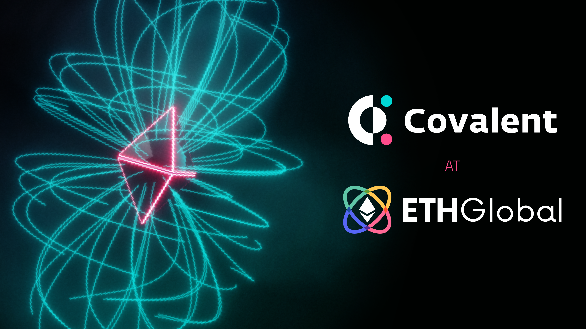

# ETHGlobal

ETHGlobal is the most experienced Web3 event organization in both online and offline events.

Since running the world’s first major Ethereum hackathon ETHWaterloo, ETHGlobal has run 19 hackathons and conferences with attendees from over 100 countries with over 12,500 technical attendees and has played a pivotal role in the development of Ethereum and Web3. 

Major events include:
- [HackMoney](https://defi.ethglobal.co/)
- HackFS
- [ETHOnline](https://ethonline.org/)
- [NFTHack](https://nft.ethglobal.co/)
- [Scaling Ethereum](https://scaling.ethglobal.co/)

Covalent is a top-tier sponsor at ETHGlobal. Our general campaign website with Developer Resources and past event details is: https://ethglobal.covalenthq.com/

&nbsp;
### ETHGlobal Discord Support Channel
https://discord.gg/eKHHzxf