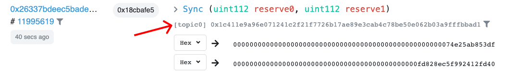
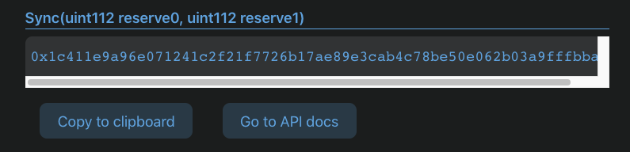

# Uniswap as an Oracle Price Feed
<Aside>

**Outcome:** Learn how to extract all the Uniswap `Sync` log events on Ethereum Mainnet using the Covalent API and calculate the the real-time and historical price of the relevant tokens.

</Aside>

&nbsp;
## Introduction

One of the underappreciated features of Unsiwap is its utility as a **Price Oracle**. In this recipe, we will use the `Sync` log event to calculate a **Price Feed**. This recipe is broken down into three steps:
1. Find the topic hash for a `Sync` event.
2. Use the Covalent API to fetch the event logs.
3. Calculate the Price feed using data from step 1 and 2 above.


### Prerequisites

<Aside>

Using the Covalent API can begin as soon as you create an account, and requires two steps:

1. [Obtain your API key](https://www.covalenthq.com/platform/#/auth/register) so Covalent can authenticate your API requests

2. [Test your API key](https://www.covalenthq.com/docs/api/) directly from our docs to confirm your key is set up correctly

</Aside>


## Endpoints Summary

The key Covalent API endpoints covered here are:

<Definitions>

- `v1/{chainId}/events/topics/{topic}/`
  - Return a paginated list of decoded log events with one or more topic hashes separated by a comma.

</Definitions>


&nbsp;
## Extracting an exchange contract `Sync` event

For illustrative purposes, we will pick the `USDC-ETH` uniswap pool at the address `0xb4e16d0168e52d35cacd2c6185b44281ec28c9dc`. 

&nbsp;
### 1) Find the topic hash for `Sync` events

On Etherscan, we see the [events emitted](https://etherscan.io/address/0xb4e16d0168e52d35cacd2c6185b44281ec28c9dc#events) from this contract:



We see that the topic hash for the `Sync` event is `0x1c411e9a96e071241c2f21f7726b17ae89e3cab4c78be50e062b03a9fffbbad1`. 

Another way to calculate the topic hash is to use the Covalent [Topic Hash Calculator](../../tools/topic-calculator).




&nbsp;
### 2) Use the Covalent API `v1/{chainId}/events/topics/{topic}/` endpoint to fetch the event logs

The Covalent API [GET log events by topic hash](https://www.covalenthq.com/docs/api/#get-/v1/{chainId}/events/topics/{topic}/) endpoint lets you fetch fully decoded events logs. You can call it with the following parameters:

<TableWrap>

|Parameter|Value|
|---|---|
|`chainId`|`1`|
|`topic`|`0x1c411e9a96e071241c2f21f7726b17ae89e3cab4c78be50e062b03a9fffbbad1`|
|`starting-block`|`11995619`|
|`ending-block`|`latest`|
|`sender-address`|`0xb4e16d0168e52d35cacd2c6185b44281ec28c9dc`|

</TableWrap>

**Also note that the `sender-address` is our `USDC-ETH` pool contract address.** 


Our response from the Covalent API looks something like this (only 1 record shown):

```json
{
  "data": {
    "updated_at": "2021-03-08T06:36:13.987447062Z",
    "items": [
      {
        "block_signed_at": "2021-03-08T04:12:30Z",
        "block_height": 11995619,
        "tx_offset": 130,
        "log_offset": 213,
        "tx_hash": "0x26337bdeec5badee6f52c571a4785ee1fac956df2e2c29b313ffae0477045f53",
        "_raw_log_topics_bytes": null,
        "raw_log_topics": [
          "0x1c411e9a96e071241c2f21f7726b17ae89e3cab4c78be50e062b03a9fffbbad1"
        ],
        "sender_address": "0xb4e16d0168e52d35cacd2c6185b44281ec28c9dc",
        "sender_address_label": null,
        "raw_log_data": "0x000000000000000000000000000000000000000000000000000074e25ab853df000000000000000000000000000000000000000000000fd828ec5f992412fd40",
        "decoded": {
          "name": "Sync",
          "signature": "Sync(uint112 reserve0, uint112 reserve1)",
          "params": [
            {
              "name": "reserve0",
              "type": "uint112",
              "indexed": false,
              "decoded": true,
              "value": "128515533460447"
            },
            {
              "name": "reserve1",
              "type": "uint112",
              "indexed": false,
              "decoded": true,
              "value": "74822942799933302046016"
            }
          ]
        }
      },
      ...
    ]
  }
}
```

The values under `decoded.params` are the values of the two liquidity reserves of the `USDT` and `ETH` tokens in the pool.

&nbsp;
### 3) Calculate the price

Before you can calculate the price from the `Sync` event - you first need to understand how to format these reserves. The reserves are recorded using the contract decimals for the two tokens. In this case:

<TableWrap>

|Token|Name|Decimals|Recorded value|Scaled value|
|---|---|---|---|---|
|USDC|USD Coin|6|128515533460447|128,515,533.460447|
|ETH|Ether|18|74822942799933302046016|74,822.942799933302046|

</TableWrap>

Therefore, the price of `ETH` in the units of `USDC` is

<Aside>

128,515,533.460447 / 74,822.942799933302046 = 1,717.595280956545859

</Aside>

&nbsp;
## Next steps

Congratulations :tada: :sparkles: You have made a delicacy!

You can use this method to calculate token prices for any pool contract across any Uniswap-like AMM. For example, the same method works on PancakeSwap (Binance Smart Chain), QuickSwap (Matic), RamenSwap (Binance Smart Chain) and so on.

Just be aware that different tokens have different contract decimals and will need to be scaled accordingly.
