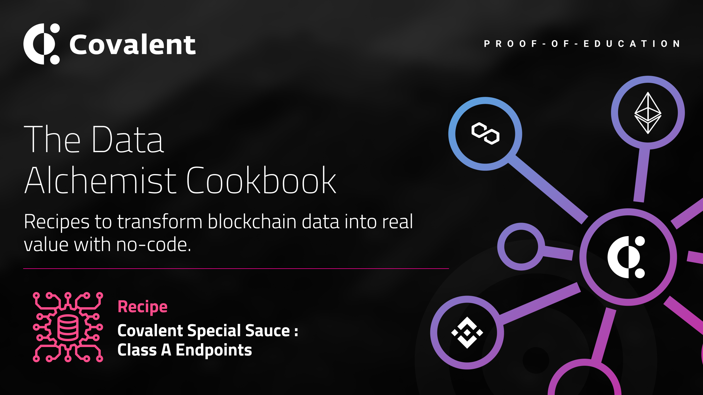

# Class A Endpoints
<Aside>

**Outcome:** Learn what the core *Class A* endpoints are and how they can be used to get detailed wallet, NFT and transaction data across multiple blockchain networks seamlessly.

</Aside>

&nbsp;
## Introduction
We at Covalent define *Class A* endpoints as those that return enriched blockchain data and are applicable to all blockchain networks such as balances, transactions, log events, etc. These endpoints are *generic* and are available via the same API on all supported blockchains. All the user needs to do is simply change a single parameter - the `chainId`. 

<Aside>

Each of the Covalent API Class A endpoints can *individually* power entire apps!

</Aside>

These endpoints are part of our unique value proposition and, we believe, are not matched by any competitor in the blockchain space. 

&nbsp;
### Prerequisites

<Aside>

Using the Covalent API can begin as soon as you create an account, and requires two steps:

1. [Obtain your API key](https://www.covalenthq.com/platform/#/auth/register) so Covalent can authenticate your API requests

2. [Test your API key](https://www.covalenthq.com/docs/api/) directly from our docs to confirm your key is set up correctly

</Aside>

&nbsp;
## Endpoints Summary:
The following are the most popular Class A endpoints with a description of the enriched blockchain data they return: 

<Definitions>

- `{chainId}/address/{address}/balances_v2/`
  - Get token balances for `address`. Return a list of all ERC20 and NFT token balances including ERC721 and ERC1155 along with their current spot prices.

- `{chainId}/address/{address}/transactions_v2/`
  - Retrieve all transactions for `address` including their decoded log events. This endpoint does a deep-crawl of the blockchain to retrieve all kinds of transactions that references the address.

- `{chainId}/address/{address}/transfers_v2/`
  - Get ERC20 token transfers for `address` alongwith historical token prices.

- `{chainId}/tokens/{address}/nft_metadata/{tokenId}/`
  - Given a NFT contract address and a token ID, fetch and return the external metadata. Both ERC751 as well as ERC1155 are supported.

- `{chainId}/tokens/{contract_address}/token_holders/`
  - Return a paginated list of token holders `contract_address` as of any historical block height.

- `{chainId}/events/address/{contract_address}/`
  - Return a paginated list of decoded log events emiited by a particular smart contract.

- `{chainId}/events/topics/{topic}/`
  - Return a paginated list of decoded log events with one or more topic hashes separated by a comma.

</Definitions>

The following tutorials use JavaScript code templates and the Covalent [API docs](https://www.covalenthq.com/docs/api/#overview) to explore several API endpoints and how they can individually power entire apps. The code templates are hosted on Repl.it. 

## Tutorial Videos

<Definitions>

- [Wallet Balances](https://repl.it/@1millionwallets/Template-Wallet-Balance-Dashboard-JavaScript#README.md)
  - This tutorial walks through the details of using the `balances_v2` API endpoint. We will then use the response data and a basic HTML/CSS/JavaScript front-end to create a simple wallet dashboard.

- [NFT Wallet Balances](https://repl.it/@1millionwallets/Template-NFTWalletBalanceJS#README.md)
  - This tutorial builds upon the previous tutorial to return additional granualar data about the NFTs (both ERC721 and ERC1155 interface standards).

- [Wallet Transfers](https://repl.it/@1millionwallets/Template-Wallet-Balance-and-Transfers#README.md)
  - This tutorial walks through the details of using the `transfers_v2` API endpoint. We will then use the response data and a basic HTML/CSS/JavaScript front-end to create a simple wallet balance and transfers dashboard.

</Definitions>
