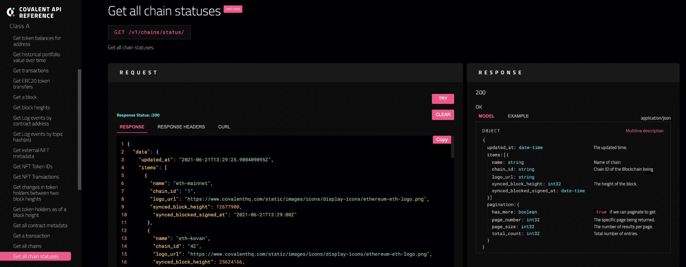

# Front-end Guide - ReactJS
<Aside>

**Outcome:** Learn how to consume the Covalent API using the ReactJS frontend Library. Guides includes using `fetch` or `axios` and hiding your API Keys using the `dotenv` library.

</Aside>

## Introduction
Building with the Covalent API is a breeze! A cool breeze! You can take that literally! I am always of the opinion that Covalent represents the easiest point of entry for web2 developers and data scientists to begin and immediately start making sense of blockchain data!
In this article using a simple app to consume one endpoint GET All Chain Status, I’ll explain how you can start consuming the Covalent API as a web2 developer using either Axios or Fetch library to make requests to the API and display it in your app. We will use the create-react-app library to initialize the project.



### Outlined are the steps:
- Initialize project using create react app
- Install required HTTP client dependencies
- Consume Covalent API
- Display data on the Frontend

### Initialize project using create react app
ReactJS is a JavaScript library for building user interfaces. This article assumes that you already have knowledge of building apps using ReactJS. We will simply have a high-level overview of the basic commands you can use to start building this project

Open a terminal and run the following commands to create a new react app

```javascript
npx create-react-app my-app
cd my-app
npm start
```
The first commands create a new shiny react app called my-app. The second command is then to change the directory into the my-app folder and then using the third commandnpm start, you can then run the app which is then available at http://localhost:3000


### Install required HTTP client dependencies
For this project, we will use `Axios` and `Fetch` to consume the Covalent API. `Axios` and `Fetch` are primarily similar in functionality. They are both HTTP request libraries. It is recommended to use either of them and not both at the same time. Based on personal preference, many developers use one as against the other. We use both in this article to demonstrate their basic usage when wrangling data using the Covalent API.

As mentioned earlier, it is recommended to use one of the two libraries, you can install using the commands - 
when using `Axios` 

`npm install axios`

and when using `Fetch` 

`npm install fetch`

### Consume Covalent API
At the beginning of the article, it was mentioned that we will be querying the GET All Chain Statusendpoint as an example. Visit Covalent API docs and there you will find the resource on how to wrangle data using a particular endpoint. First, you will have to sign up for an API Key.

First, open `my-app` in your favorite text editor and go to the app.js file where we will write the example code. At this point the `app.js` contains the skeleton code which currently displays the content on the frontend.

```javascript
import logo from './logo.svg';
import './App.css';

function App() {
  return (
    <div className="App">
      <header className="App-header">
        
        <p>
          Edit <code>src/App.js</code> and save to reload.
        </p>
        <a
          className="App-link"
          href="https://reactjs.org"
          target="_blank"
          rel="noopener noreferrer"
        >
          Learn React
        </a>
      </header>
    </div>
  );
}

export default App;
```

We have the HTTP client installed and then we can following a sequential step to consume the Covalent API.

### Using `Fetch`
We are using React Hooks and will be using the following React hooks, `useState` and `useEffect`.
`useState` is a Hook that let’s you add state to React function components. `useEffect` allows a user perform side effects in function components.

First, add the hooks to the app.js on the first line

`import { useState, useEffect} from "react";`

Update the App function by setting a state where the items returned from the endpoint will be “stored”.

`const [items, setItems] = useState([]);`

Next will be to write a simple async/awaitfunction to fetch the data from the endpoint. We will call this function `getData`

```javascript
const getData = async () => {
     const response = await fetch("https://api.covalenthq.com/v1/chains/status/?key='your-api-key'")
     const data = response.json()
     setItems(data.data.items)
}
```

We parse the url containing the endpoint and your-api-key into the fetch method. Then set a const data which will hold the response as a JSON object which is the default response format of the Covalent API. The `setItems` is the state function that updates the items array in the state.
The `getData()` function will be called into the useEffect hook to prevent the app from multiple re-renders.

```javascript
useEffect(() => {
   getData()
}, [])
```
If you add a `console.log` statement to return the data, you should see the data via the console in your web browser.


### Using Axios
First, you have to import the axios package into the `app.js` file

`import axios from "axios";`

Update the `getData` function to use axios to make the requests in a try-catch block.

```javascript
try {
      const response = await axios.get("https://api.covalenthq.com/v1/chains/status/?key='your-key'");
      setItems(response.data.data.items)
} catch (err) {
        console.error(err);
}
```

You can confirm that the data is returned by checking the console response.

### Display data on the Front-end
This is by far the simplest part of the entire process! All you have to do is map over the itemsarray in the response and return the information which you so desire. For this use case, we will simply return the data in an unordered list.

First, clean out the code in the header block in the app.js file leaving only the divstatement, you can add text such as Welcome in between the divs and save. Now, you will see the text “Welcome” displayed on the screen. Using curly braces, we will map over the items and display each item name.

```javascript
<ul>
 {items.map(item => {
                    <li key={item.chain_id}>
                        {item.name}
                    </li>
                       }
               )}
</ul>
```

Your `app.js` should look like this:

```javascript
import { useState, useEffect } from "react";
import axios from "axios";

function App() {
  const [items, setItems] = useState([]);

  useEffect(() => {
      getData()
  }, [])

  const getData = async () => {
    //Using fetch
    const response = await fetch("https://api.covalenthq.com/v1/chains/status/?key=your-api-key")
    const data = await response.json()
    setItems(data.data.items)
    
    //using axios
    /**
    try {
      const response = await axios.get('https://api.covalenthq.com/v1/chains/status/?key=your-key');
      console.log(response.data.data);
      setItems(response.data.data.items)
         } catch (err) {
      // Handle Error Here
      console.error(err);
     }
     **/
  }

  return (
    <div className="App">
      {console.log(items)}
      Welcome 
      <ul>
        {items.map(item => (
          <li key={item.chain_id}>
            {item.name}
          </li>
        ))}
      </ul>
      </div>
  );
}

export default App;
```

### Conclusion
There you have it, how to consume the Covalent API using React Hooks and display the data on the front-end! You can begin with this as a starting point and style your app and also consume multiple endpoints.
If you have any further questions, you can reach the DevRel team on the [Covalent Discord](https://covalenthq.com/discord) server.
