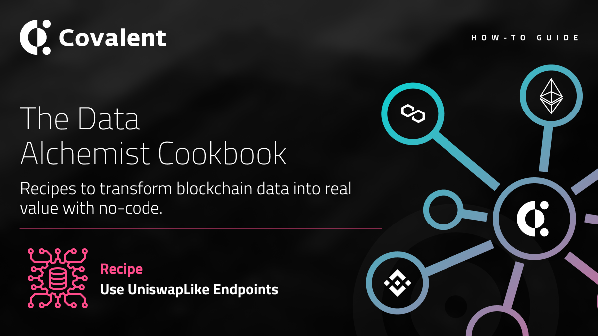

# UniswapLike Endpoints
<Aside>

**Outcome:** Learn how a universal set of endpoints can be used to on any supported *Uniswap clone* to fetch swap, volume, liquidity, pool, token and other key metrics for the DEX. 

</Aside>

&nbsp;
## Introduction
We at Covalent have generally built out custom *Class B* endpoints to provide exchange, liquidity, swap and other granular and historical data for large DEXs such as PancakeSwap and SushiSwap, which are effectively clones of the core Uniswap code base. Thus, we revised our approach to build out a set of universal endpoints which can be applied to any supported *Uniswap clone* to fetch swap, volume, liquidity, pool, token and other key metrics. All the user has to do is simply replace the `dexname` in the API calls shown below by the name of a supported Uniswap clone.   

<Aside>

Current supported Uniswap clone `dexname`s include:
* `sushiswap`
* `quickswap`
* `pangolin`
* `spiritswap`
* `spookyswap`

</Aside>

&nbsp;
### Prerequisites

<Aside>

Using the Covalent API can begin as soon as you create an account, and requires two steps:

1. [Obtain your API key](https://www.covalenthq.com/platform/#/auth/register) so Covalent can authenticate your API requests

2. [Test your API key](https://www.covalenthq.com/docs/api/) directly from our docs to confirm your key is set up correctly

</Aside>

&nbsp;
## Endpoints Summary:
The following universal endpoints work with multiple Uniswap clones across multiple networks: 

<Definitions>

- `https://api.covalenthq.com/v1/{chain_id}/uniswaplikev2service/{dexname}/health/?`
  - Get the health status of the Uniswaplike v2 dex. Returns the latest sync block.

- `https://api.covalenthq.com/v1/{chain_id}/uniswaplikev2service/{dexname}/ecosystem/?`
  - Get Uniswaplike v2 Ecosystem data. Returns total volume and total liquidity chart data over the last 30 days.

- `https://api.covalenthq.com/v1/{chain_id}/uniswaplikev2service/{dexname}/pools/?`
  - Get Uniswaplike v2 pool data.

- `https://api.covalenthq.com/v1/{chain_id}/uniswaplikev2service/{dexname}/pools/address/{address}/?`
  - Get Uniswaplike v2 pool data by address. Includes 7 day and 30 day volume and liquidity chart data.

- `https://api.covalenthq.com/v1/{chain_id}/uniswaplikev2service/{dexname}/pools/address/{address}/transactions/?`
  - Get Uniswaplike v2 pool transactions by address. Returns the latest 20 swap, mint and burn events.

- `https://api.covalenthq.com/v1/{chain_id}/uniswaplikev2service/{dexname}/tokens/?`
  - Get Uniswaplike v2 token data.

- `https://api.covalenthq.com/v1/{chain_id}/uniswaplikev2service/{dexname}/tokens/address/{address}/?`
  - Get Uniswaplike v2 pool data by address. Includes 7 day and 30 day volume, liquidity and pricing chart data.

- `https://api.covalenthq.com/v1/{chain_id}/uniswaplikev2service/{dexname}/tokens/address/{address}/transactions/?`
  - Get Uniswaplike v2 pool token transactions by address. Returns the latest 20 swap, mint and burn events.

- `https://api.covalenthq.com/v1/{chain_id}/uniswaplikev2service/{dexname}/address/{address}/balances/?`
  - Get Uniswaplike v2 address exchange balances. Returns the LP balances of the address.

- `https://api.covalenthq.com/v1/{chain_id}/uniswaplikev2service/{dexname}/address/{address}/transactions/?`
  - Get Uniswaplike v2 address exchange liquidity transactions.

</Definitions>

