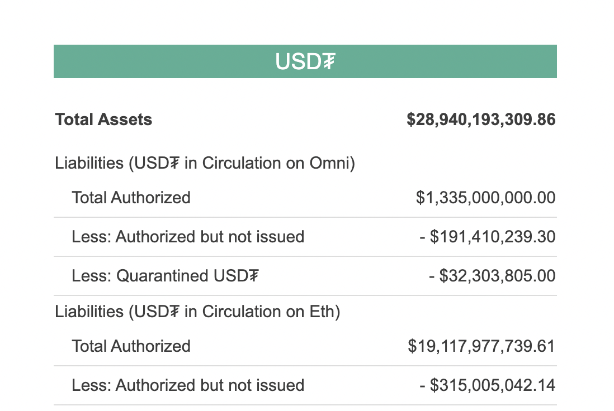
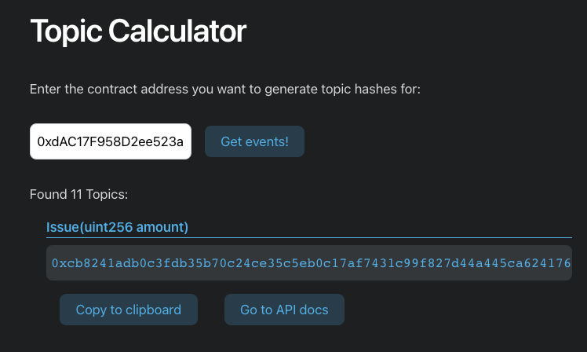

# Analyze Tether issuances
<Aside>

**Outcome:** Learn how to extract all the USDT `Issue` log events on Ethereum Mainnet using the Covalent API and compare the total amount issued with Tether's Transparency Dashboard.

</Aside>

&nbsp;
## Introduction

Tether is a blockchain-based cryptocurrency whose tokens in circulation are declared to be backed by an equivalent amount of traditional fiat currencies, like the dollar, which are held in a designated bank account. Tether tokens, the native tokens of the Tether network, trade under the USDT symbol, and belong to the group of cryptocurrencies called *stablecoins*. 

There is no shortage of controversy around Tether (see https://crypto-anonymous-2021.medium.com/the-bit-short-inside-cryptos-doomsday-machine-f8dcf78a64d3) but the purpose of this case study is to understand how we can use the Covalent API to do our own Tether analysis and see if the underlying blockchain data tells us the same story as what Tether publishes on their [Transparency Dashboard](https://wallet.tether.to/transparency).



<Aside>

**Note:** This case study only looks at USDT issuances on Ethereum. 

</Aside>

## Endpoints Summary:

The key Covalent API endpoints covered here are:

<Definitions>

- `v1/{chainId}/events/topics/{topic}/`
  - Return a paginated list of decoded log events with one or more topic hashes separated by a comma.

- `v1/pricing/historical/{quote_currency}/{ticker_symbol}/`
  - Get historical prices for a `ticker_symbol` in a particular `quote_currency`. Can pass `to` and `from` dates. By default, it returns the current price.

</Definitions>


### Prerequisites

<Aside>

Using the Covalent API can begin as soon as you create an account, and requires two steps:

1. [Obtain your API key](https://www.covalenthq.com/platform/#/auth/register) so Covalent can authenticate your API requests

2. [Test your API key](https://www.covalenthq.com/docs/api/) directly from our docs to confirm your key is set up correctly

</Aside>

While no coding is required to carry out the analysis, we will be using the Covalent API feature of `csv` data exports and Google Sheets to filter and plot the data.

&nbsp;
## Extracting the USDT contract `Issue` events

### 1) Find the USDT smart contract address, contract decimals and starting block
In order to get the timeseries data of when USDT was minted and the amounts, we need to look at the USDT smart contract code. To find the smart contract, we can simply go to [Etherscan](https://etherscan.io/) and search for `USDT`. 

<Aside>

The USDT contract address is: `0xdAC17F958D2ee523a2206206994597C13D831ec7`

The USDT contract decimal is: `6`

</Aside>

The contract decimal refers to the base units of USDT so a value of 1000000 USDT base units refers to 1 USDT. 

If we take a look a the contract code, we see that when new tokens are issued, an `event Issue(uint amount)` is logged. These tokens are deposited into the owner's address. Note on the Tether [Transparency Dashboard](https://wallet.tether.to/transparency), issued tokens are actually referred to as *Total Authorized*, as they may not be circulating. 


On Etherscan, we can also see the transaction when the USDT contract was created: https://etherscan.io/tx/0x2f1c5c2b44f771e942a8506148e256f94f1a464babc938ae0690c6e34cd79190. 


<Aside>

The USDT contract was deployed at block `4634748`. This will be our `starting-block`.

</Aside>


&nbsp;
### 2) Find the `Issue` event topic hash
This step is harder to do on Etherscan because it requires having to scroll through many log events to find the `Issue` event, and even then the number of log events displayed is limited. Luckily our [Topic Hash Calculator](../../tools/topic-calculator) makes this simple to find.



We simply paste in our USDT contract address, `0xdAC17F958D2ee523a2206206994597C13D831ec7` and we get the `Issue` topic hash:

<Aside>

`0xcb8241adb0c3fdb35b70c24ce35c5eb0c17af7431c99f827d44a445ca624176a`

</Aside>

&nbsp;
### 3) Get all the USDT `Issue` events
We now use the Covalent API [GET log events by topic hash](https://www.covalenthq.com/docs/api/#get-/v1/{chainId}/events/topics/{topic}/) endpoint with the following parameters. Note that the Covalent API currently limits the block range between the `starting-block` and the `ending-block` to 1 million blocks. Hence, this data will need to be fetched in batches of 1 million blocks.

<TableWrap>

|Parameter|Value|
|---|---|
|`chainId`|`1`|
|`topic`|`0xcb8241adb0c3fdb35b70c24ce35c5eb0c17af7431c99f827d44a445ca624176a`|
|`starting-block`|`4634748`|
|`ending-block`|`5634748`|
|`sender-address`|`0xdAC17F958D2ee523a2206206994597C13D831ec7`|
|`format`|`csv`|

</TableWrap>

From Etherscan, the current Ethereum mainnet block height, as of `"2021-02-08T17:31:52Z"` is `11817192`. For the `ending-block` field, we can use the value `latest` to ensure we get data up to the latest block height. 

* Increase the value of the `starting-block` and `ending-block` in increments of `1000000` until we can use an `ending-block` of `latest` (currently `11817192`).

Also note that the `sender-address` is our USDT contract address. 

Our response from the Covalent API looks something like this (only 1 record shown):

```csv
---
header: Get decoded USDT Issue log events in csv format
---
block_signed_at,block_height,tx_offset,log_offset,tx_hash,sender_address,sender_address_label,raw_log_data,raw_log_topics_0,decoded_name,decoded_signature,decoded_params_name,decoded_params_type,decoded_params_indexed,decoded_params_decoded,decoded_params_value
"2017-11-28T16:24:26Z",4638757,9,5,"0x8cfc4f5f4729423f59dd1d263ead2f824b3f133b02b9e27383964c7d50cd47cb","0xdac17f958d2ee523a2206206994597c13d831ec7",,"0x00000000000000000000000000000000000000000000000000000002540be400",,"Issue","Issue(uint256 amount)","amount","uint256",false,true,"10000000000"
"2017-11-28T16:24:26Z",4638757,9,5,"0x8cfc4f5f4729423f59dd1d263ead2f824b3f133b02b9e27383964c7d50cd47cb","0xdac17f958d2ee523a2206206994597c13d831ec7",,"0x00000000000000000000000000000000000000000000000000000002540be400","0xcb8241adb0c3fdb35b70c24ce35c5eb0c17af7431c99f827d44a445ca624176a","Issue","Issue(uint256 amount)",,,,,
```

We copy & paste this data into a Google Sheet and use `Data -> Split text to columns` to split the CSV data into individual columns.

Here is a copy you can fork if you would like to use for your own analysis: https://docs.google.com/spreadsheets/d/17GmBqd73_YLsb21yhfrOGt95P9L0rNAYhtKGIN8bx6Q/edit?usp=sharing

The Covalent API provides detailed, granular blockchain transaction data, including decoded log events. The values in the column `decoded_params_value` show the amounts of USDT issued but the units for these values are the **USDT base units** so we need to divide by `10^6` to get the actual USDT values. 

If we do a quick sum of the `decoded_params_value` column and divide by `10^6`, we get a value of: `19,160,018,006 USDT`. Taking a look at the Tether Transparency Dashboard, we see the total authorized amount of *USDT in Circulation on Eth* to be: `$19,117,977,739.61 USD` so our value in USDT is within `0.22%` of the Tether figure. 

If we want to be even more precise, we can get and use the *daily spot price* of USDT, which fluctuates around the `$1 USD` value, with this Covalent API endpoint: [GET historical prices by ticker symbol](https://www.covalenthq.com/docs/api/#get-/v1/pricing/historical/{quote_currency}/{ticker_symbol}/). 

&nbsp;
## Summary
In this case study, we analyzed the amount of USDT issued by Tether to verify if the amounts highlighted on their Transparency Dashboard match the underlying blockchain data. We extracted a specific decoded log event (the `Issue` event) for the Tether token (USDT) contract, and summed the total amount issued since contract genesis. This process required us to:
- Find the USDT contract address and genesis data from Etherscan
- Use the Covalent [Topic Hash Calculator](../../tools/topic-calculator) which makes it simple to find the topic hash value of a log event
- Use the Covalent API and specifically the [`Get Log events by topic hash`](https://www.covalenthq.com/docs/api/#get-/v1/{chainId}/events/topics/{topic}/) endpoint which makes it easy to extract decoded blockchain transaction logs.

We determined that, to date, `19,160,018,006 USDT` has been recorded as issued to the USDT contract owner's address since 2017-11-28, which is within `0.22%` of the `$19,117,977,739.61 USD` figure reported on the Tether Transparency Dashboard. The discrepency is due to the `USDT/USD` exchange rate which fluctuates around `$1`.

&nbsp;
### Next Steps
The reader can plot `USDT` issuances with the historical `BTC` price to determine the correlation using interactive data visualization tools like Tableau. Here is a sample dashboard with this plot:


