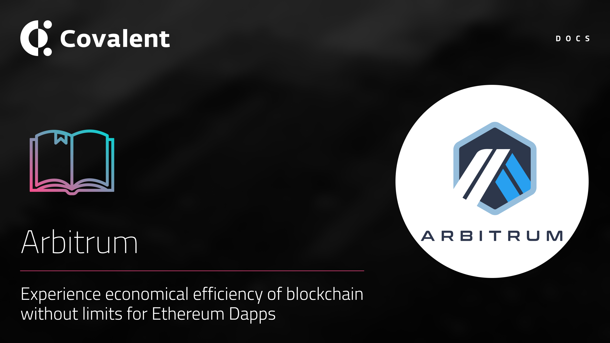

# Arbitrum Network

## Introduction

[Arbitrum](https://developer.offchainlabs.com/docs/developer_quickstart) Arbitrum is an L2 scaling solution for Ethereum. It is a suite of Ethereum scaling solutions that enables high-throughput, low cost smart contracts while remaining trustlessly secure.Abitrum possesses the following features: 
- Trustless security: security rooted in Ethereum, with any one party able to ensure correct Layer 2 results
- Compatibility with Ethereum: able to run unmodified EVM contracts and unmodified Ethereum transactions
- Scalability: moving contracts’ computation and storage off of the main Ethereum chain, allowing much higher throughput
- Minimum cost: designed and engineered to minimize the L1 gas footprint of the system, minimizing per-transaction cost.
### Quick facts

<TableWrap>

|Property|Value|
|---|---|
|Arbitrum Mainnet chainId|`42161`|
|Arbitrum Testnet chainId|`421611`|
|Arbitrum Blockchain Explorer|https://explorer.offchainlabs.com/|

</TableWrap>

<!-- ### Quickstart overview video
<YouTube id="qhibXxKANWE"/> -->

## Supported endpoints

<Aside>

All [**Class A**](https://www.covalenthq.com/docs/api/#tag--Class-A) endpoints are supported for the Arbitrum mainnet and testnet. You can query either network via the unified API by changing the `chainId`.

</Aside>

<Definitions>

- `api.covalenthq.com/v1/{chainId}/address/{address}/balances_v2/`

  - Get token balances for `address`. Return a list of all ERC20 and NFT token balances including ERC721 and ERC1155 along with their current spot prices.

- `api.covalenthq.com/v1/{chainId}/address/{address}/transactions_v2/`

  - Retrieve all transactions for `address` including their decoded log events. This endpoint does a deep-crawl of the blockchain to retrieve all kinds of transactions that references the address.

- `api.covalenthq.com/v1/{chainId}/address/{address}/transfers_v2/`

  - Get ERC20 token transfers for `address` along with historical token prices.

- `api.covalenthq.com/v1/{chainId}/tokens/{contract_address}/token_holders/`

  - Return a paginated list of token holders `contract_address` as of any historical block height.

- `api.covalenthq.com/v1/{chainId}/events/address/{contract_address}/`

  - Return a paginated list of decoded log events emitted by a particular smart contract.

- `api.covalenthq.com/v1/{chainId}/events/topics/{topic}/`
  - Return a paginated list of decoded log events with one or more topic hashes separated by a comma.

</Definitions>

<a target="_blank" class="Button Button-is-docs-primary" href="https://www.covalenthq.com/docs/api/">Go to Covalent's API Reference</a>

--- 