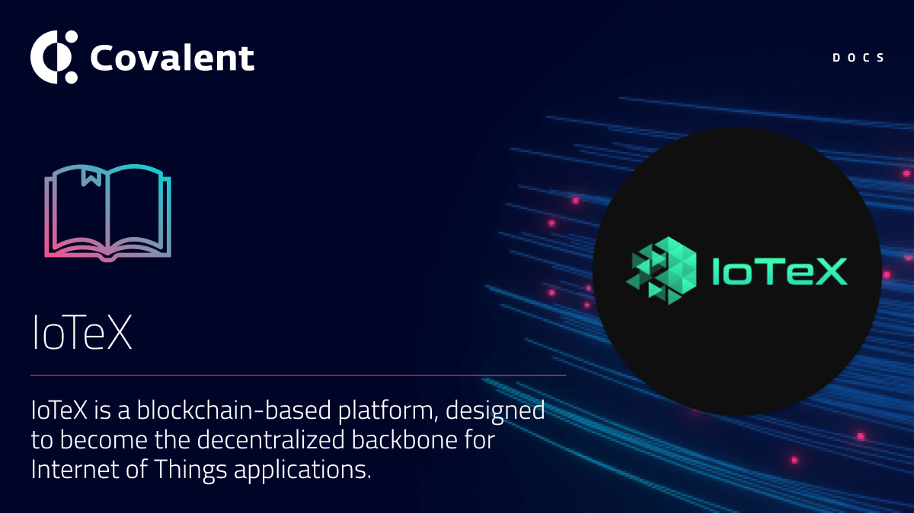

# IoTeX

## Introduction

[IoTeX](https://iotube.org/) is a blockchain-based platform, designed to become the decentralized backbone for Internet of Things applications. 

With an ever-growing ecosystem of projects and products from DeFi to Tools to Gaming, IoTeX currently leads the world’s premier industry consortiums and standards bodies such as IEEE, IIC, and more. With numerous contributions to the Blockchain and IoT space, the IoTeX blockchain already powers real devices, including Ucam, an award-winning blockchain-powered cameras presented at the Consumer Electronics Show (CES) and the Pebble geo device. Pebble is a secure device designed by IoTeX and perfect for supply chain optimization in any industry. As a next step, IoTeX is launching "MachineFi" , to power next-gen IoT applications.

### Quick facts

<TableWrap>

|Property|Value|
|---|---|
|IoTeX Mainnet chainId |`4689`|
|IoTeX Testnet chainId |`4690`|
|IoTeX Bridge |https://iotube.org/|
|IoTeX Blockchain Explorer |https://iotexscan.io/|
|Block time |~5 seconds|

</TableWrap>

## Supported endpoints

<Aside>

All __Class A__ endpoints are supported for the IoTeX mainnet and the testnet. You can query either network via the unified API by changing the `chainId`.

</Aside>

<Definitions>

- `api.covalenthq.com/v1/{chainId}/address/{address}/balances_v2/` 
  - Get token balances for `address`. Return a list of all ERC20 and NFT token balances including ERC721 and ERC1155 along with their current spot prices.

- `api.covalenthq.com/v1/{chainId}/address/{address}/transactions_v2/` 
  - Retrieve all transactions for `address` including their decoded log events. This endpoint does a deep-crawl of the blockchain to retrieve all kinds of transactions that references the address.

- `api.covalenthq.com/v1/{chainId}/address/{address}/transfers_v2/` 
  - Get ERC20 token transfers for `address` alongwith historical token prices.

- `api.covalenthq.com/v1/{chainId}/tokens/{contract_address}/token_holders/` 
  - Return a paginated list of token holders `contract_address` as of any historical block height.

- `api.covalenthq.com/v1/{chainId}/events/address/{contract_address}/` 
  - Return a paginated list of decoded log events emitted by a particular smart contract.

- `api.covalenthq.com/v1/{chainId}/events/topics/{topic}/` 
  - Return a paginated list of decoded log events with one or more topic hashes separated by a comma.

</Definitions>

<a target="_blank" class="Button Button-is-docs-primary" href="https://www.covalenthq.com/docs/api/">Go to Covalent's API Reference</a>

--- 
