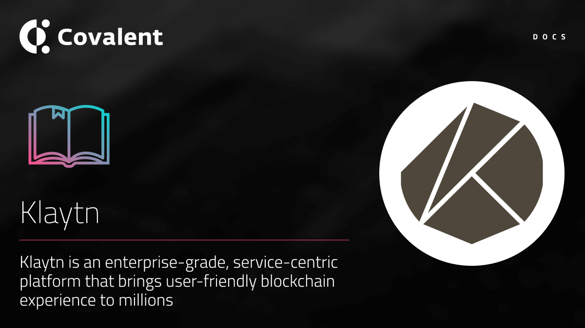

# Klaytn Network

## Introduction

The [Klaytn Network](https://klaytn.foundation/) is a global public blockchain platform developed by Ground X, the blockchain affiliate of the leading South Korean Internet company, Kakao.
Klaytn is a service-centric blockchain platform providing an intuitive development environment and friendly end-user experience. It is built upon solid reliability and significant stability with substantial service development for mass adoption.
The platform allows real-world applications of large scale to be produced right away so that our end-users can make full use of services without much expertise in blockchain or cryptocurrency.

### Quick facts

<TableWrap>

|Property|Value|
|---|---|
|Klaytn Mainnet Cypress chainId|`8217`|
|Klaytn Testnet Baobab chainId|`1001`|
|Klaytn Blockchain Explorer|https://scope.klaytn.com/|
|Block time|~1 second|

</TableWrap>

## Supported endpoints

<Aside>

All __Class A__ endpoints are supported for the Klaytn mainnet `Cypress` and the Klaytn testnet `Baobab`. You can query either network via the unified API by changing the `chainId`.

</Aside>

<Definitions>

- `api.covalenthq.com/v1/{chainId}/address/{address}/balances_v2/` 
  - Get token balances for `address`. Return a list of all ERC20 and NFT token balances including ERC721 and ERC1155 along with their current spot prices.

- `api.covalenthq.com/v1/{chainId}/address/{address}/transactions_v2/` 
  - Retrieve all transactions for `address` including their decoded log events. This endpoint does a deep-crawl of the blockchain to retrieve all kinds of transactions that references the address.

- `api.covalenthq.com/v1/{chainId}/address/{address}/transfers_v2/` 
  - Get ERC20 token transfers for `address` alongwith historical token prices.

- `api.covalenthq.com/v1/{chainId}/tokens/{contract_address}/token_holders/` 
  - Return a paginated list of token holders `contract_address` as of any historical block height.

- `api.covalenthq.com/v1/{chainId}/events/address/{contract_address}/` 
  - Return a paginated list of decoded log events emitted by a particular smart contract.

- `api.covalenthq.com/v1/{chainId}/events/topics/{topic}/` 
  - Return a paginated list of decoded log events with one or more topic hashes separated by a comma.

</Definitions>

<a target="_blank" class="Button Button-is-docs-primary" href="https://www.covalenthq.com/docs/api/">Go to Covalent's API Reference</a>

--- 

## Appendix

### Klaytn Gas token

KLAY token is the native token of the Klaytn network. This is similar to Ether in Ethereum. To interact with the Klaytn network, KLAY tokens are required to pay as gas fees. KLAY serves as a means of payment and exchange for all applications running in the Klaytn ecosystem. Covalent's  responses automatically returns `gas_*` fields in the KLAY units.
