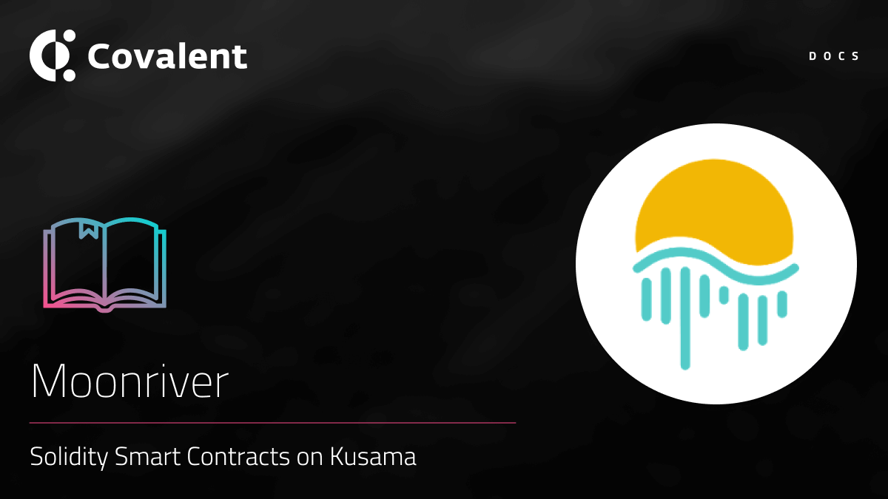

# Moonriver Network

## Introduction

[Moonriver](https://moonbeam.network/networks/moonriver/) is an Ethereum-compatible Solidity Smart Contracts Parachain on Kusama.

Moonriver is a companion network to Moonbeam and provides a permanently incentivized canary network. New code ships to Moonriver first, where it can be tested and verified under real economic conditions. Once proven, the same code ships to Moonbeam on Polkadot. Moonriver is a Community-Led Sister Parachain on Kusama.

### Quick facts

<TableWrap>

| Property              | Value                |
| --------------------- | -------------------- |
| Moonriver Kusama (not live yet) | `1285` |
| Blockchain Explorer|https://blockscout.moonriver.moonbeam.network/|

</TableWrap>

#### Independent Network

While Moonbeam code launches to Moonriver first, the network will continue to live on as a parachain on Kusama, with its own projects and specialized use cases.

#### Network Launch Status

Moonriver will follow a similar launch process as Kusama and Polkadot to ensure the stability of the network while it is deployed. This [page](https://moonbeam.network/networks/moonriver/launch/) contains the updates as each launch phase of the Moonriver Network is completed.

## Supported endpoints

<Aside>

All [**Class A**](https://www.covalenthq.com/docs/api/#tag--Class-A) endpoints will be supported for the Moonriver network. You can query the network via the unified API by changing the `chainId` when it has been fully indexed.

</Aside>

<Definitions>

- `api.covalenthq.com/v1/{chainId}/address/{address}/balances_v2/`

  - Get token balances for `address`. Return a list of all ERC20 and NFT token balances including ERC721 and ERC1155 along with their current spot prices.

- `api.covalenthq.com/v1/{chainId}/address/{address}/transactions_v2/`

  - Retrieve all transactions for `address` including their decoded log events. This endpoint does a deep-crawl of the blockchain to retrieve all kinds of transactions that references the address.

- `api.covalenthq.com/v1/{chainId}/address/{address}/transfers_v2/`

  - Get ERC20 token transfers for `address` along with historical token prices.

- `api.covalenthq.com/v1/{chainId}/tokens/{contract_address}/token_holders/`

  - Return a paginated list of token holders `contract_address` as of any historical block height.

- `api.covalenthq.com/v1/{chainId}/events/address/{contract_address}/`

  - Return a paginated list of decoded log events emitted by a particular smart contract.

- `api.covalenthq.com/v1/{chainId}/events/topics/{topic}/`
  - Return a paginated list of decoded log events with one or more topic hashes separated by a comma.

</Definitions>

<a target="_blank" class="Button Button-is-docs-primary" href="https://www.covalenthq.com/docs/api/">Go to Covalent's API Reference</a>

---

## Appendix

### Moonriver token

Moonriver’s native cryptocurrency, `MOVR`, should play a key role in maintaining and operating the Moonriver network. It is expected to be used for paying transaction fees, supporting smart contract execution, incentivizing collators for producing blocks to support the network, and facilitating Moonriver’s on-chain governance mechanism.