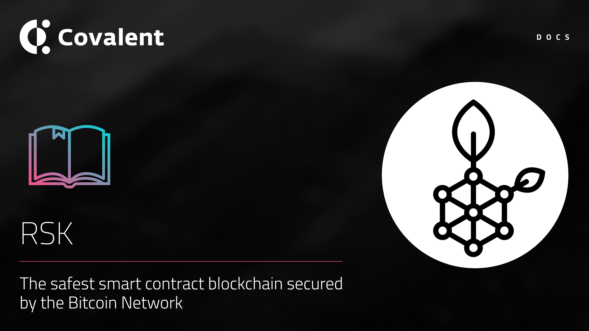

# RSK Network

## Introduction

[RSK](https://www.rsk.co/) is the first general purpose smart contract platform secured by the Bitcoin Network.
RSK’s Contracts goal is to add value and functionality to the bitcoin Contracts ecosystem by enabling smart contracts, near instant Contracts payments, and higher scalabiity.
RSK Blockchain is connected to Bitcoin through Merged
Contracts Mining and a two-way peg also known as the bridge.

The RSK blockchain is highly decentralised. RSK is merge-mined with Bitcoin, and has a hashpower that is second only to Bitcoin. As such, it is believed to be the most secure and censorship resistant smart contract platform. Refer to [RSK Stats](https://stats.rsk.co/) for the live value of the RSK hash rate.

### Quick facts

<TableWrap>

|Property|Value|
|---|---|
|RSK Mainnet chainId|`30`|
|RSK Testnet chainId|`31`|
|RSK Blockchain Explorer|https://explorer.rsk.co/|
|Block time|https://stats.rsk.co/|

</TableWrap>

<!-- ### Quickstart overview video
<YouTube id="qhibXxKANWE"/> -->

## Supported endpoints

<Aside>

All [**Class A**](https://www.covalenthq.com/docs/api/#tag--Class-A) endpoints are supported for the RSK mainnet and testnet. You can query either network via the unified API by changing the `chainId`.

</Aside>

<Definitions>

- `api.covalenthq.com/v1/{chainId}/address/{address}/balances_v2/`

  - Get token balances for `address`. Return a list of all ERC20 and NFT token balances including ERC721 and ERC1155 along with their current spot prices.

- `api.covalenthq.com/v1/{chainId}/address/{address}/transactions_v2/`

  - Retrieve all transactions for `address` including their decoded log events. This endpoint does a deep-crawl of the blockchain to retrieve all kinds of transactions that references the address.

- `api.covalenthq.com/v1/{chainId}/address/{address}/transfers_v2/`

  - Get ERC20 token transfers for `address` along with historical token prices.

- `api.covalenthq.com/v1/{chainId}/tokens/{contract_address}/token_holders/`

  - Return a paginated list of token holders `contract_address` as of any historical block height.

- `api.covalenthq.com/v1/{chainId}/events/address/{contract_address}/`

  - Return a paginated list of decoded log events emitted by a particular smart contract.

- `api.covalenthq.com/v1/{chainId}/events/topics/{topic}/`
  - Return a paginated list of decoded log events with one or more topic hashes separated by a comma.

</Definitions>

<a target="_blank" class="Button Button-is-docs-primary" href="https://www.covalenthq.com/docs/api/">Go to Covalent's API Reference</a>

--- 
## Appendix

### RIF Token Contract

[0x2acc95758f8b5f583470ba265eb685a8f45fc9d5](https://explorer.rsk.co/address/0x2acc95758f8b5f583470ba265eb685a8f45fc9d5)
### RSK Smart Contract Address Mapping

| Address | Ethereum mainnet                           | RSK                            |
| ----- | ------------------------------------------ | ------------------------------------------ |
| bridge  | 0x12ed69359919fc775bc2674860e8fe2d2b6a7b5d | 0x9d11937e2179dc5270aa86a3f8143232d6da0e69 |
| federation   | 0x479F86eCbE766073D2712EF418acEb56d5362a2B | 0xE37b6516F4FE2A27569a2751C1aD50F6340DF369 |
| allowTokens  | 0xe4aa0f414725c9322a1a9d80d469c5e234786653 | 0xe4aa0f414725c9322a1a9d80d469c5e234786653 |
| multiSigWallet   | 0x040007b1804ad78a97f541bebed377dcb60e4138 | 0x040007b1804ad78a97f541bebed377dcb60e4138 |

Mainnet and Testnet address mapping reference [doc](https://github.com/rsksmart/tokenbridge/blob/master/docs/ContractAddresses.md) for Ethereum and RSK. 