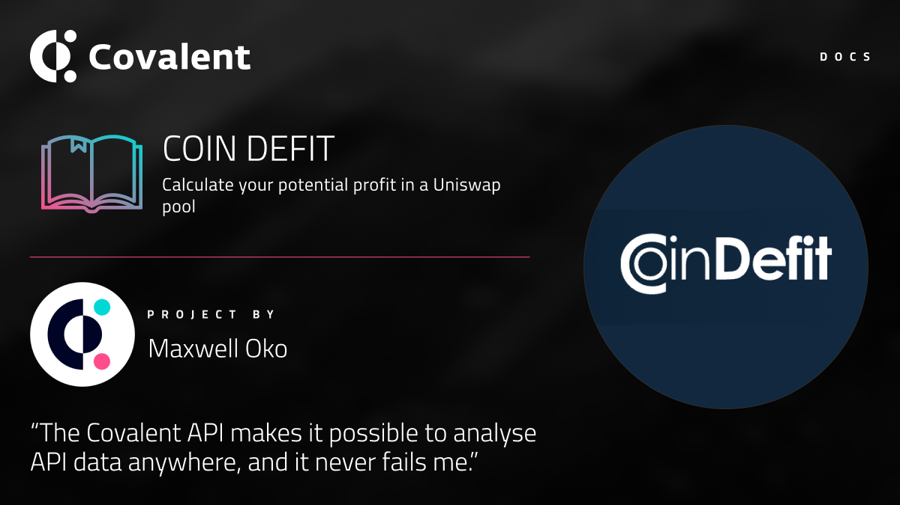
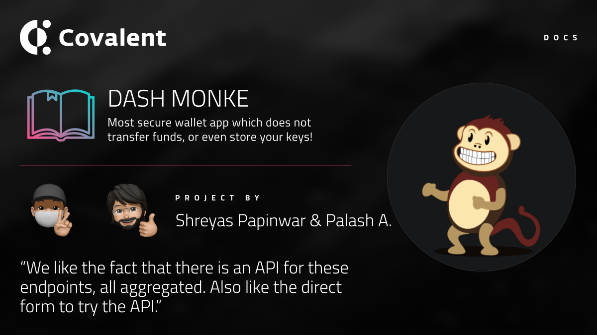

# Project Showcase
Our ecosystem of community developers continue to astonish us with their creativity in using the Covalent API to power their dApps! Here is a showcase of some of the best projects we have seen to date:

&nbsp;
## Independent Projects

### [GoSwapp](/project-showcase/goswapp)

### [Coin Defit](/project-showcase/coindefit)

&nbsp;
## OneMillionWallet Hackathons

### [Hestia](/project-showcase/hestia)

### [Dash Monke](/project-showcase/dash-monke)

&nbsp;
## ETHGlobal Hackathons

### [Collectors Cafe](/project-showcase/collectors-cafe)

&nbsp;
## Dungeons & Data Challenges

### [Aave Governance](/project-showcase/aave-governance)

&nbsp;
## Alchemists Buidlers
### [Nifty NFTS](/project-showcase/nifty-nfts)

