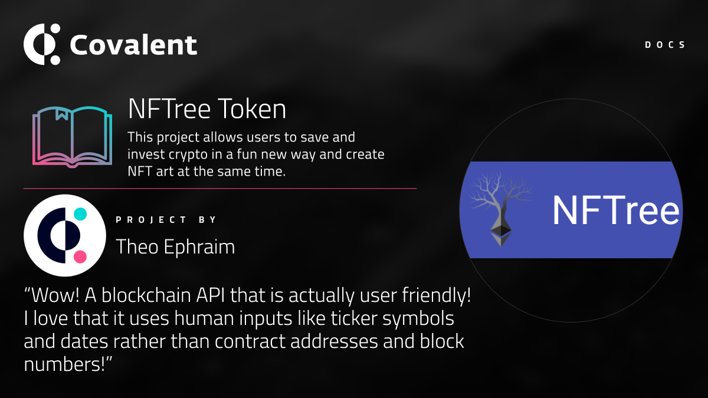

&nbsp;
# NFTree

### Website
https://nftreetoken.com/

<Aside>

"Wow! A blockchain API that is actually user friendly!
I love that it uses human inputs like ticker symbols and dates rather than contract addresses and block numbers, and it's easy to fetch all of the data I need in one request. <3"

</Aside>

&nbsp;
### Use of Covalent API
Hitting API and getting json to convert block numbers to dates, get historical prices in date ranges. Used the Covalent API to get NFT holdings for an address to display images in wallet/gallery.

&nbsp;
### Event
The project was built at [#ETHGlobal - NFTHack](https://www.covalenthq.com/blog/nfthack-winners-announcement/)

&nbsp;
### Developers

- Theo Ephraim: *Discord - ETHeo#5209*

