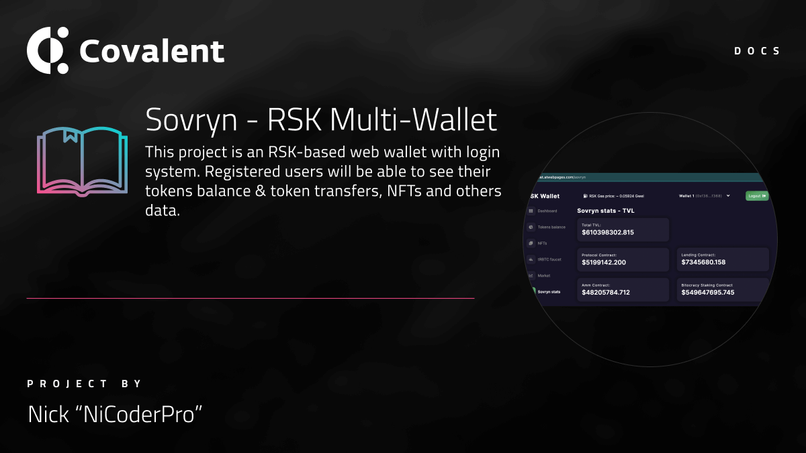

&nbsp;

# Sovryn - RSK Multi-Wallet

### Website

http://rsk-wallet.atwebpages.com/login

&nbsp;

This project is an RSK-based web wallet with login system. Registered users will be able to see their tokens balance & token transfers, NFTs and others data. 

### Event

The project was built at [Gitcoin - Sovrython Hackathon 2021](https://www.covalenthq.com/blog/gitcoin-sovrython-winners/)

&nbsp;

### Developers

- Nick "NiCoderPro"